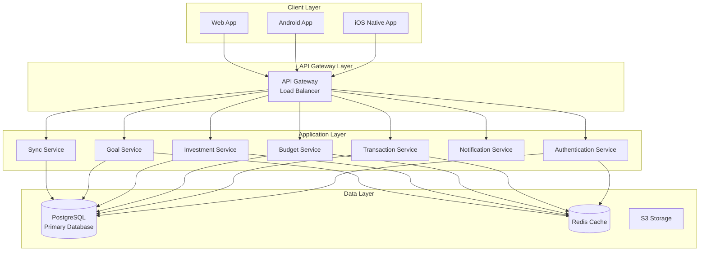
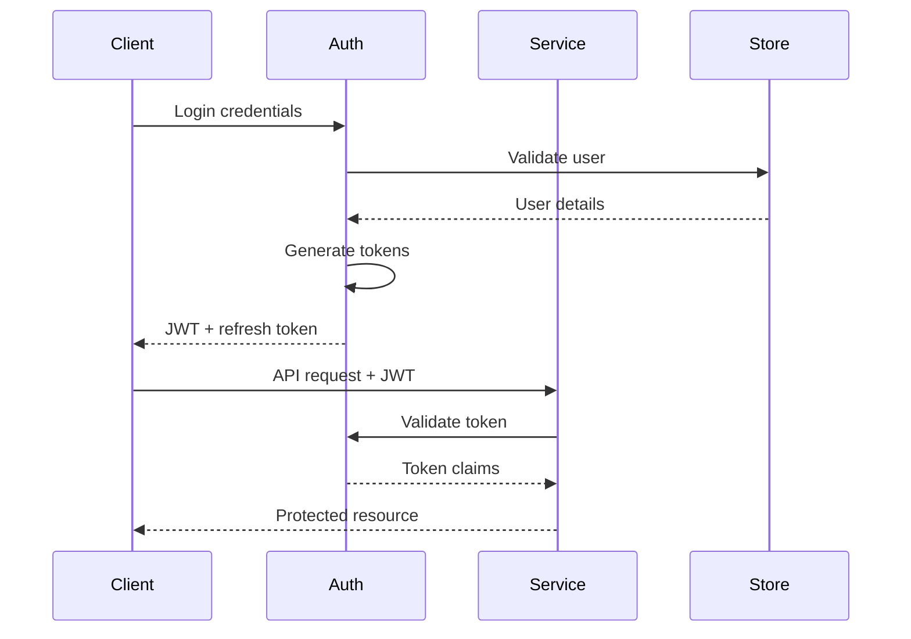

# Mint Replica Lite

<!-- Human Tasks:
1. Configure PostgreSQL database credentials in backend .env
2. Set up Redis instance with appropriate memory allocation
3. Configure Apple Developer account for iOS development
4. Set up Firebase project and add configuration files
5. Generate and configure SSL certificates for production
6. Set up monitoring and alerting thresholds
7. Configure backup retention policies
8. Set up CI/CD pipeline access and permissions
-->

## Project Overview

Mint Replica Lite is a comprehensive financial management system that provides users with a consolidated view of their financial accounts, transactions, budgets, and investment portfolios. The system consists of native iOS, React Native Android/Web applications, and cloud-based backend services.

### Technology Stack

- Backend: Python ^3.9.0
- iOS: Swift 5.0+
- Android/Web: React Native ^0.71.0
- Infrastructure: Docker ^20.0, Kubernetes ^1.24.0

## System Architecture



## Getting Started

### Prerequisites

1. Development Tools
   - Git
   - Docker Desktop ^20.0
   - Kubernetes ^1.24.0
   - Visual Studio Code (recommended)

2. Platform-specific Requirements
   - iOS: Xcode 14.0+, CocoaPods
   - Android/Web: Node.js 16+, React Native CLI
   - Backend: Python 3.9+, PostgreSQL 13+, Redis 6+

### Environment Setup

```bash
# Clone repository
git clone https://github.com/your-org/mint-replica-lite.git
cd mint-replica-lite

# Backend setup
cd src/backend
python -m venv venv
source venv/bin/activate  # Unix
.\venv\Scripts\activate   # Windows
pip install -r requirements.txt

# iOS setup
cd src/ios
pod install
open MintReplicaLite.xcworkspace

# Web/Android setup
cd src/web
npm install
# or
yarn install
```

## Component Setup

### Backend Service

```bash
cd src/backend

# Configure environment
cp .env.example .env
# Edit .env with your configuration

# Initialize database
python manage.py db init
python manage.py db migrate
python manage.py db upgrade

# Start development server
python run.py
```

### iOS Application

```bash
cd src/ios

# Install dependencies
pod install

# Open in Xcode
open MintReplicaLite.xcworkspace

# Build and run
# Select target device/simulator in Xcode and press ⌘R
```

### Web/Android Application

```bash
cd src/web

# Start Metro bundler
npm start
# or
yarn start

# Run on Android
npm run android
# or
yarn android

# Run on Web
npm run web
# or
yarn web
```

## Development Guidelines

### Git Workflow

1. Create feature branch from `develop`
2. Implement changes following style guides
3. Submit PR with description and tests
4. Obtain code review approval
5. Merge to `develop`

### Coding Standards

- iOS: Follow Swift style guide and SwiftLint rules
- Android/Web: ESLint + Prettier configuration
- Backend: PEP 8 + Black formatter
- All: 80% minimum test coverage

### Testing Requirements

- Unit tests for business logic
- Integration tests for API endpoints
- UI tests for critical flows
- Performance tests for key operations

## Deployment

### Environment Configuration

```bash
# Production deployment
docker-compose -f docker-compose.prod.yml up -d

# Kubernetes deployment
kubectl apply -f k8s/production/
```

### CI/CD Pipeline

1. Automated builds on PR
2. Test suite execution
3. Security scanning
4. Docker image creation
5. Staging deployment
6. Production deployment

## Security

### Authentication Flow



### Security Protocols

- TLS 1.3 for all communications
- AES-256 encryption for sensitive data
- JWT-based authentication
- Role-based access control
- Field-level encryption
- Secure credential storage

## License

Copyright (c) 2023 Mint Replica Lite Team. All rights reserved.

## Maintenance

- Version: 1.0.0
- Last Updated: ${DATETIME}
- Maintainers: Backend Team, iOS Team, Web Team, DevOps Team
- Review Frequency: Monthly