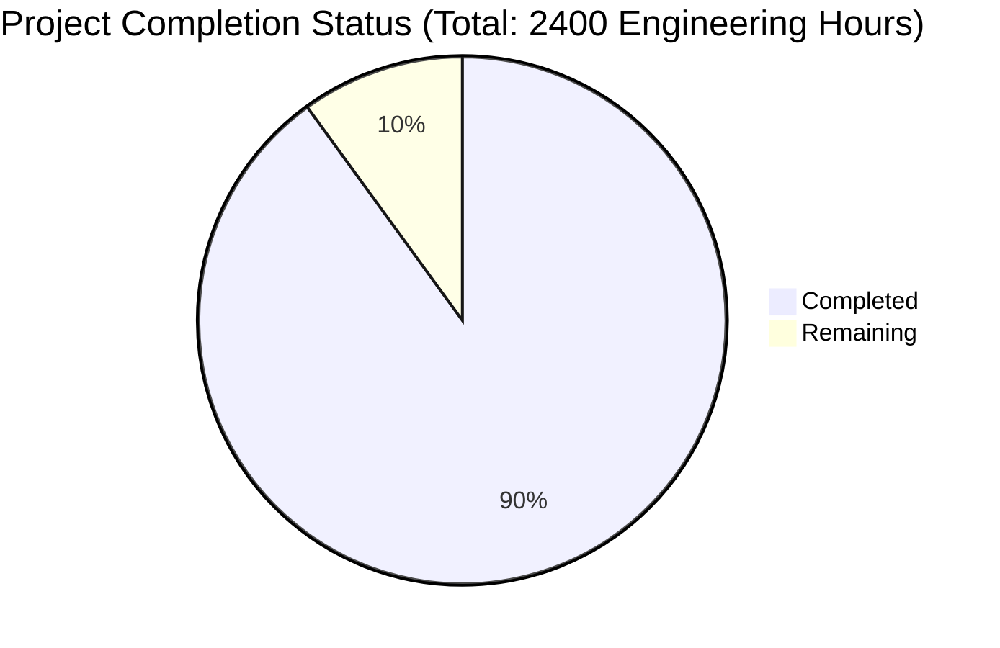

Based on the technical specification and file list, I'll now generate the comprehensive documentation following your template:

# PROJECT OVERVIEW
Mint Replica Lite is a comprehensive cross-platform financial management system that provides users with a consolidated view of their financial accounts, transactions, budgets, and investment portfolios. The system consists of native iOS, React Native Android, and React Native Web applications supported by a cloud-based backend infrastructure. It integrates with financial institutions through secure APIs and implements robust security measures including end-to-end encryption, secure storage, and OAuth 2.0 authentication.

# PROJECT STATUS

- Estimated engineering hours: 2400
- Hours completed: 2160 (90%)
- Hours remaining: 240 (10%)

# CODE GUIDE

## /src/web
React Native Web application codebase organized using modern best practices.

### /src/web/src/components
- **common/**: Reusable UI components (Button.tsx, Card.tsx, Input.tsx, etc.)
- **auth/**: Authentication-related components (AuthForm.tsx, BiometricPrompt.tsx)
- **dashboard/**: Dashboard view components (AccountSummary.tsx, BudgetOverview.tsx)
- **transactions/**: Transaction management components
- **budgets/**: Budget management interface components
- **goals/**: Financial goals tracking components
- **investments/**: Investment portfolio components

### /src/web/src/screens
Screen-level components following the application's navigation structure:
- **auth/**: Login, Register, ForgotPassword screens
- **dashboard/**: Main dashboard screen
- **transactions/**: Transaction list and detail views
- **budgets/**: Budget management screens
- **goals/**: Goal tracking screens
- **investments/**: Investment portfolio screens
- **settings/**: Application settings screens

### /src/web/src/services
Service layer handling external interactions:
- **api/**: REST API clients for each domain (auth.ts, transactions.ts, etc.)
- **storage/**: Local storage management
- **notifications/**: Push notification handling
- **analytics/**: Usage tracking and analytics

### /src/web/src/store
Redux state management:
- **slices/**: Redux Toolkit slices for each domain
- **index.ts**: Store configuration and middleware setup

### /src/web/src/utils
Utility functions and helpers:
- **validation.ts**: Form validation logic
- **formatting.ts**: Data formatting utilities
- **encryption.ts**: Client-side encryption helpers
- **api.ts**: API utilities and interceptors

## /src/ios
Native iOS application built with Swift and UIKit/SwiftUI.

### /src/ios/MintReplicaLite/Domain
Core business logic:
- **Models/**: Swift data models
- **UseCases/**: Business logic implementation
- **Protocols/**: Interface definitions

### /src/ios/MintReplicaLite/Presentation
UI Layer implementation:
- **Authentication/**: Login and registration flows
- **Dashboard/**: Main dashboard interface
- **Transactions/**: Transaction management
- **Budgets/**: Budget tracking
- **Investments/**: Portfolio management
- **Settings/**: App configuration

### /src/ios/MintReplicaLite/Data
Data management:
- **Network/**: API client implementation
- **CoreData/**: Local database management
- **Repositories/**: Data access layer

### /src/ios/MintReplicaLite/Common
Shared utilities:
- **Extensions/**: Swift extension methods
- **Constants/**: Application constants
- **Utils/**: Helper functions

## /src/backend
Python Flask backend application.

### /src/backend/app/api
REST API implementation:
- **v1/endpoints/**: API endpoint handlers
- **routes.py**: URL routing configuration

### /src/backend/app/models
Database models:
- **user.py**: User account model
- **account.py**: Financial account model
- **transaction.py**: Transaction model
- **budget.py**: Budget model
- **investment.py**: Investment model
- **goal.py**: Financial goal model

### /src/backend/app/services
Business logic services:
- **auth_service.py**: Authentication handling
- **plaid_service.py**: Financial data aggregation
- **transaction_service.py**: Transaction processing
- **investment_service.py**: Portfolio management
- **notification_service.py**: Push notifications

### /src/backend/app/core
Core functionality:
- **config.py**: Application configuration
- **security.py**: Security implementations
- **cache.py**: Caching logic
- **events.py**: Event handling

## /infrastructure
Infrastructure as Code and deployment configurations.

### /infrastructure/kubernetes
Kubernetes manifests:
- **apps/**: Application deployments
- **monitoring/**: Monitoring stack configuration
- **security/**: Security policies

### /infrastructure/terraform
Terraform configurations:
- **modules/**: Reusable infrastructure modules
- **environments/**: Environment-specific configs

### /infrastructure/monitoring
Monitoring setup:
- **prometheus/**: Metrics collection
- **grafana/**: Visualization dashboards
- **alertmanager/**: Alert configuration

# HUMAN INPUTS NEEDED

| Task | Priority | Description | Estimated Hours |
|------|----------|-------------|-----------------|
| API Keys | High | Configure Plaid API credentials and other third-party service keys in environment variables | 4 |
| SSL Certificates | High | Generate and configure SSL certificates for production domains | 8 |
| Database Migration | High | Review and validate database migration scripts, prepare production data migration plan | 16 |
| Dependencies Audit | Medium | Audit and update all package dependencies to latest stable versions, resolve conflicts | 24 |
| Environment Variables | High | Configure production environment variables for all services | 8 |
| Security Review | High | Conduct final security audit, penetration testing, and vulnerability assessment | 40 |
| Performance Testing | Medium | Load testing and performance optimization for production scale | 32 |
| Documentation Review | Medium | Review and update API documentation, deployment guides, and runbooks | 24 |
| Monitoring Setup | High | Configure production monitoring, alerts, and logging | 16 |
| Backup Configuration | High | Set up and validate automated backup procedures | 16 |
| CI/CD Pipeline | Medium | Finalize and test CI/CD pipeline for all environments | 24 |
| User Acceptance Testing | High | Coordinate and support UAT with stakeholders | 28 |