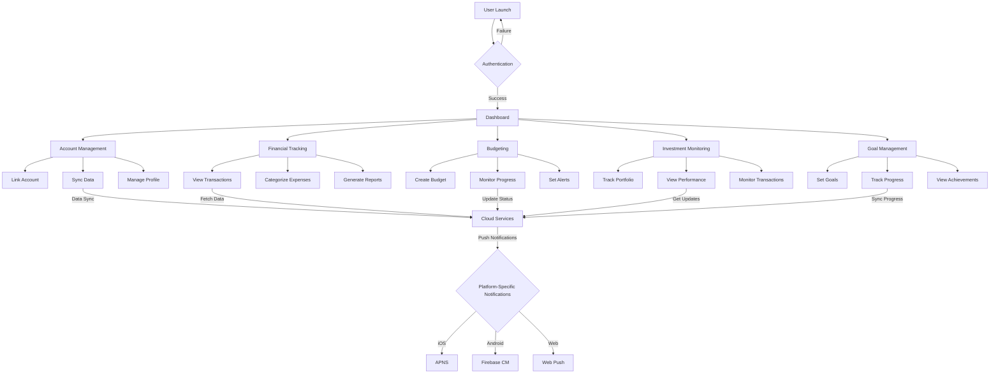
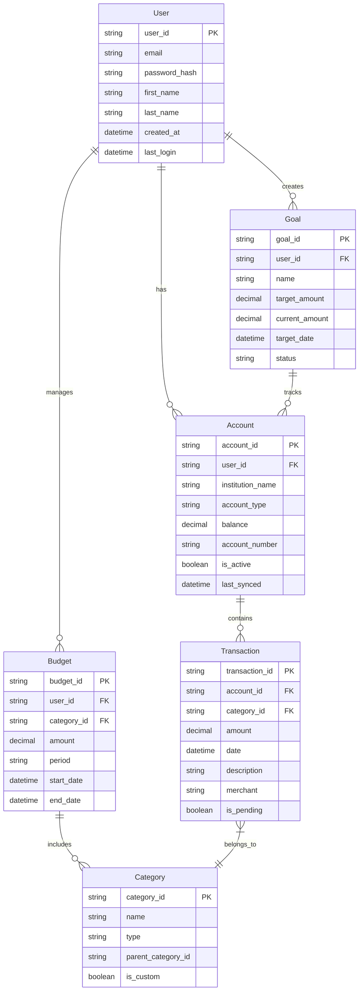
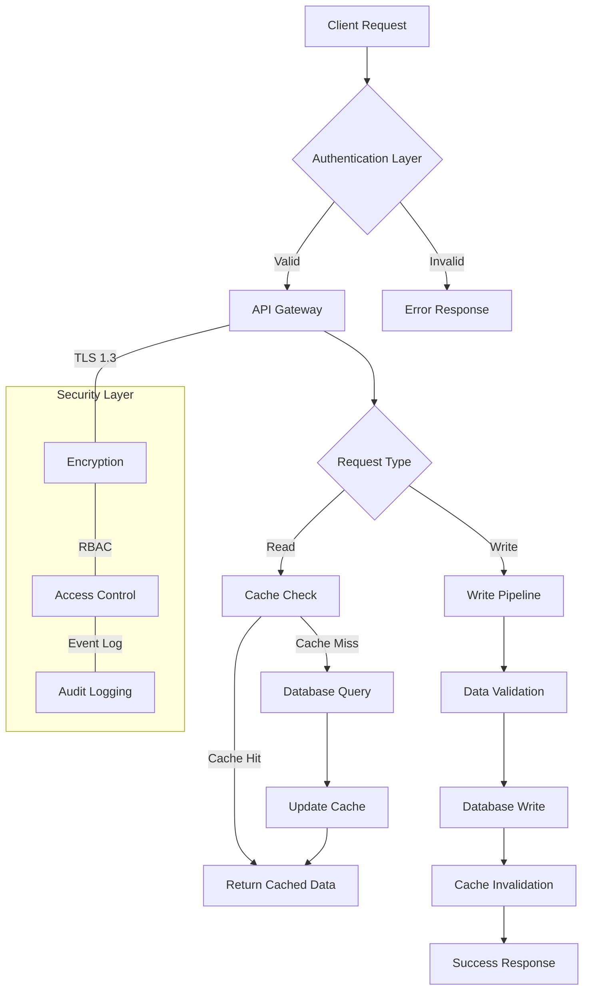

# 1. Introduction

## 1.1 Purpose

This Software Requirements Specification (SRS) document provides a comprehensive description of the implementation requirements for the Mint Replica Lite financial management application. It is intended for use by software developers, system architects, project managers, QA engineers, and other technical stakeholders involved in the development process. The document details functional and non-functional requirements, system architecture, and platform-specific implementation guidelines.

## 1.2 Scope

Mint Replica Lite is a cross-platform personal financial management application that will be available on iOS, Android, and Web platforms. The system encompasses:

- Account aggregation and synchronization across multiple financial institutions
- Real-time transaction tracking and categorization
- Budgeting tools with customizable categories and alerts
- Basic investment portfolio monitoring
- Financial goal setting and progress tracking
- Cross-platform data synchronization
- Secure authentication and data protection

Key technical implementations include:
- Native Swift development for iOS
- React Native for Android platform
- React Native Web for browser-based access
- RESTful API services with cloud-based architecture
- Platform-specific security measures and optimizations

The system will not include:
- Advanced investment analysis tools
- Tax preparation features
- Bill payment capabilities
- Credit score monitoring
- Financial advisory services

# 2. Product Description

## 2.1 Product Perspective
Mint Replica Lite operates as a standalone financial management system while integrating with external financial institutions through secure APIs. The system architecture consists of:

- Platform-specific client applications (iOS, Android, Web)
- Cloud-based backend services
- Third-party financial data aggregation services
- Secure authentication and data storage systems

The application functions within the broader financial technology ecosystem, interfacing with:
- Banking institutions
- Credit card providers
- Investment account platforms
- Financial data aggregation services (e.g., Plaid)
- Platform-specific notification systems (APNS, Firebase)

## 2.2 Product Functions
The core functions of Mint Replica Lite include:

1. Account Management
   - Financial account aggregation and synchronization
   - Multi-platform authentication
   - User profile management

2. Financial Tracking
   - Real-time transaction monitoring
   - Automated categorization
   - Custom category management
   - Spending analysis and reporting

3. Budgeting
   - Category-based budget creation
   - Progress monitoring
   - Alert notifications
   - Budget vs. actual analysis

4. Investment Monitoring
   - Basic portfolio tracking
   - Investment account integration
   - Performance metrics display
   - Transaction categorization

5. Goal Management
   - Financial goal setting
   - Progress tracking
   - Goal-specific account linking
   - Achievement monitoring

## 2.3 User Characteristics
The system targets three primary user personas:

1. Young Professionals
   - Age: 25-35
   - Tech-savvy
   - Multiple financial accounts
   - Basic investment experience
   - Primary focus on budgeting and expense tracking

2. Budget-Conscious Adults
   - Age: 35-50
   - Moderate technical proficiency
   - Multiple financial obligations
   - Focus on family expense management
   - Interest in goal-based savings

3. Digital-Native Students
   - Age: 18-24
   - High technical aptitude
   - Limited financial accounts
   - Learning financial management
   - Need for basic budgeting tools

## 2.4 Constraints

1. Technical Constraints
   - iOS minimum version: iOS 15.0+
   - Android minimum version: 6.0 (API level 23)
   - Web browser compatibility requirements
   - Mobile device storage limitations
   - Network bandwidth requirements

2. Security Constraints
   - Financial data protection regulations
   - Platform-specific security requirements
   - Authentication protocol limitations
   - Data encryption standards

3. Business Constraints
   - Third-party API usage limits
   - Development timeline restrictions
   - Resource allocation limitations
   - Market competition considerations

## 2.5 Assumptions and Dependencies

Assumptions:
1. Users have consistent internet connectivity
2. Financial institutions maintain stable API interfaces
3. Users possess basic financial literacy
4. Device specifications meet minimum requirements
5. Users have access to mobile devices or web browsers

Dependencies:
1. External Services
   - Financial data aggregation service availability
   - Banking institution API stability
   - Cloud service provider reliability
   - Push notification service functionality

2. Platform Dependencies
   - iOS: Swift development ecosystem
   - Android: React Native framework
   - Web: React Native Web compatibility
   - Cross-platform data synchronization services

3. Development Dependencies
   - Third-party library maintenance
   - API version compatibility
   - Security protocol updates
   - Platform-specific development tools

# 3. Process Flowchart

# 4. Functional Requirements

## 4.1 Account Management

### ID: FR-AM-01
**Description**: User Authentication and Authorization  
**Priority**: High

| Requirement | Description |
|------------|-------------|
| FR-AM-01.1 | System shall support email/password authentication |
| FR-AM-01.2 | System shall implement biometric authentication (Face ID/Touch ID for iOS, Biometric for Android) |
| FR-AM-01.3 | System shall maintain secure session management across platforms |
| FR-AM-01.4 | System shall support password reset functionality |
| FR-AM-01.5 | System shall enforce strong password requirements |

### ID: FR-AM-02
**Description**: Financial Account Integration  
**Priority**: High

| Requirement | Description |
|------------|-------------|
| FR-AM-02.1 | System shall connect to banking institutions via secure APIs |
| FR-AM-02.2 | System shall support credit card account integration |
| FR-AM-02.3 | System shall enable investment account linking |
| FR-AM-02.4 | System shall allow manual account entry |
| FR-AM-02.5 | System shall maintain daily synchronization of linked accounts |

## 4.2 Transaction Management

### ID: FR-TM-01
**Description**: Transaction Tracking  
**Priority**: High

| Requirement | Description |
|------------|-------------|
| FR-TM-01.1 | System shall automatically import transactions from linked accounts |
| FR-TM-01.2 | System shall support manual transaction entry |
| FR-TM-01.3 | System shall display transaction history with search and filter capabilities |
| FR-TM-01.4 | System shall maintain transaction synchronization across platforms |
| FR-TM-01.5 | System shall support transaction editing and deletion |

### ID: FR-TM-02
**Description**: Transaction Categorization  
**Priority**: Medium

| Requirement | Description |
|------------|-------------|
| FR-TM-02.1 | System shall automatically categorize transactions |
| FR-TM-02.2 | System shall allow manual category assignment |
| FR-TM-02.3 | System shall support custom category creation |
| FR-TM-02.4 | System shall maintain category rules and patterns |
| FR-TM-02.5 | System shall support bulk category updates |

## 4.3 Budgeting

### ID: FR-BG-01
**Description**: Budget Creation and Management  
**Priority**: High

| Requirement | Description |
|------------|-------------|
| FR-BG-01.1 | System shall enable category-based budget creation |
| FR-BG-01.2 | System shall support monthly and custom period budgets |
| FR-BG-01.3 | System shall track budget vs. actual spending |
| FR-BG-01.4 | System shall provide budget adjustment capabilities |
| FR-BG-01.5 | System shall support budget rollover options |

### ID: FR-BG-02
**Description**: Budget Alerts  
**Priority**: Medium

| Requirement | Description |
|------------|-------------|
| FR-BG-02.1 | System shall send notifications for budget threshold breaches |
| FR-BG-02.2 | System shall support custom alert thresholds |
| FR-BG-02.3 | System shall provide weekly budget status updates |
| FR-BG-02.4 | System shall enable alert customization by category |
| FR-BG-02.5 | System shall support platform-specific notifications (APNS, Firebase CM, Web Push) |

## 4.4 Investment Tracking

### ID: FR-IT-01
**Description**: Investment Portfolio Monitoring  
**Priority**: Medium

| Requirement | Description |
|------------|-------------|
| FR-IT-01.1 | System shall display investment account balances |
| FR-IT-01.2 | System shall track basic investment performance metrics |
| FR-IT-01.3 | System shall categorize investment transactions |
| FR-IT-01.4 | System shall support multiple investment account types |
| FR-IT-01.5 | System shall provide portfolio overview visualization |

## 4.5 Goal Management

### ID: FR-GM-01
**Description**: Financial Goal Setting  
**Priority**: Medium

| Requirement | Description |
|------------|-------------|
| FR-GM-01.1 | System shall support creation of financial goals |
| FR-GM-01.2 | System shall track progress towards goals |
| FR-GM-01.3 | System shall allow linking of accounts to specific goals |
| FR-GM-01.4 | System shall provide goal achievement notifications |
| FR-GM-01.5 | System shall support goal modification and deletion |

# 5. Non-Functional Requirements

## 5.1 Performance Requirements

| ID | Requirement | Target Metric |
|----|-------------|---------------|
| NFR-P-01 | Application launch time | ≤ 3 seconds |
| NFR-P-02 | Transaction sync latency | ≤ 5 seconds |
| NFR-P-03 | UI response time | ≤ 100ms |
| NFR-P-04 | Maximum memory usage (mobile) | ≤ 200MB |
| NFR-P-05 | API response time | ≤ 2 seconds |
| NFR-P-06 | Data synchronization frequency | Every 4 hours |
| NFR-P-07 | Maximum concurrent users | 100,000 |
| NFR-P-08 | Database query response time | ≤ 500ms |

## 5.2 Safety Requirements

| ID | Requirement | Description |
|----|-------------|-------------|
| NFR-S-01 | Data Backup | Automated daily backups with 30-day retention |
| NFR-S-02 | Failure Recovery | System recovery time ≤ 4 hours |
| NFR-S-03 | Data Redundancy | Geographic data replication across multiple zones |
| NFR-S-04 | Error Handling | Graceful degradation with user notifications |
| NFR-S-05 | Session Management | Automatic timeout after 15 minutes of inactivity |
| NFR-S-06 | Data Validation | Input validation for all user-entered data |
| NFR-S-07 | Transaction Rollback | Automatic rollback for failed financial transactions |

## 5.3 Security Requirements

| ID | Requirement | Implementation |
|----|-------------|----------------|
| NFR-SE-01 | Data Encryption | AES-256 encryption for data at rest |
| NFR-SE-02 | Transport Security | TLS 1.3 for all data in transit |
| NFR-SE-03 | Authentication | Multi-factor authentication support |
| NFR-SE-04 | Authorization | Role-based access control (RBAC) |
| NFR-SE-05 | Password Policy | Minimum 12 characters with complexity requirements |
| NFR-SE-06 | Audit Logging | Comprehensive security event logging |
| NFR-SE-07 | Platform Security | iOS Keychain, Android Keystore integration |
| NFR-SE-08 | Session Security | JWT with 24-hour expiration |

## 5.4 Quality Requirements

### 5.4.1 Availability
| ID | Requirement | Target |
|----|-------------|---------|
| NFR-Q-01 | System Uptime | 99.9% |
| NFR-Q-02 | Planned Maintenance Window | ≤ 4 hours/month |
| NFR-Q-03 | Recovery Time Objective (RTO) | ≤ 4 hours |
| NFR-Q-04 | Recovery Point Objective (RPO) | ≤ 1 hour |

### 5.4.2 Maintainability
| ID | Requirement | Description |
|----|-------------|-------------|
| NFR-Q-05 | Code Documentation | Comprehensive inline documentation |
| NFR-Q-06 | Version Control | Git with feature branch workflow |
| NFR-Q-07 | Testing Coverage | Minimum 80% code coverage |
| NFR-Q-08 | Deployment Automation | CI/CD pipeline for all platforms |

### 5.4.3 Usability
| ID | Requirement | Description |
|----|-------------|-------------|
| NFR-Q-09 | Platform Guidelines | iOS HIG and Material Design compliance |
| NFR-Q-10 | Accessibility | WCAG 2.1 Level AA compliance |
| NFR-Q-11 | Error Messages | Clear, actionable error messages |
| NFR-Q-12 | User Documentation | In-app help and documentation |

### 5.4.4 Scalability
| ID | Requirement | Target |
|----|-------------|---------|
| NFR-Q-13 | Horizontal Scaling | Auto-scaling support |
| NFR-Q-14 | Database Growth | 50% yearly growth capacity |
| NFR-Q-15 | API Rate Limiting | 1000 requests/minute per user |
| NFR-Q-16 | Load Balancing | Geographic distribution support |

## 5.5 Compliance Requirements

| ID | Requirement | Standard/Regulation |
|----|-------------|-------------------|
| NFR-C-01 | Financial Data Protection | PSD2 compliance |
| NFR-C-02 | Privacy Protection | GDPR and CCPA compliance |
| NFR-C-03 | Mobile Platform Guidelines | App Store and Play Store requirements |
| NFR-C-04 | Accessibility Standards | Section 508 compliance |
| NFR-C-05 | Security Standards | OWASP Top 10 compliance |
| NFR-C-06 | Data Retention | Regional data retention laws |
| NFR-C-07 | Audit Requirements | SOC 2 Type II compliance |
| NFR-C-08 | Banking Integration | Open Banking standards compliance |

# 6. Data Requirements

## 6.1 Data Models

## 6.2 Data Storage

### 6.2.1 Primary Storage
| Data Type | Storage Solution | Retention Period |
|-----------|-----------------|------------------|
| User Data | PostgreSQL | Account lifetime + 5 years |
| Transactions | PostgreSQL with partitioning | 7 years |
| Financial Documents | S3-compatible object storage | 7 years |
| Authentication Tokens | Redis | 24 hours |
| Session Data | Redis | 24 hours |

### 6.2.2 Backup and Recovery
| Component | Strategy | Frequency | Retention |
|-----------|----------|-----------|-----------|
| Database | Full backup | Daily | 30 days |
| Database | Incremental backup | Hourly | 7 days |
| Object Storage | Cross-region replication | Real-time | Continuous |
| Transaction Logs | Write-ahead logging | Real-time | 7 days |

### 6.2.3 Data Redundancy
- Geographic replication across three availability zones
- Active-passive database configuration
- Real-time synchronization with 99.99% durability
- Cross-region backup storage

## 6.3 Data Processing

### 6.3.1 Data Security Measures
| Security Layer | Implementation |
|----------------|----------------|
| Data at Rest | AES-256 encryption |
| Data in Transit | TLS 1.3 |
| Database Access | Row-level security |
| API Security | OAuth 2.0 + JWT |
| Mobile Storage | iOS Keychain/Android Keystore |
| Sensitive Data | Field-level encryption |

### 6.3.2 Data Processing Requirements
| Process | SLA | Scaling Strategy |
|---------|-----|-----------------|
| Transaction Import | < 5 seconds | Horizontal scaling with Kubernetes |
| Category Assignment | < 2 seconds | ML model deployment on GPU clusters |
| Budget Calculations | < 1 second | In-memory processing |
| Report Generation | < 30 seconds | Batch processing with Apache Spark |
| Data Synchronization | < 10 seconds | Event-driven architecture |

# 7. External Interfaces

## 7.1 User Interfaces

### 7.1.1 Mobile Platforms (iOS/Android)

| Interface Element | Requirements |
|------------------|--------------|
| Navigation | Bottom tab bar with Home, Transactions, Budgets, Goals, and Settings |
| Dashboard | Card-based layout with collapsible sections for accounts, budgets, and goals |
| Transaction List | Infinite scroll with pull-to-refresh and search functionality |
| Charts/Graphs | Native implementations (Swift Charts for iOS, React Native charts for Android) |
| Forms | Platform-specific input controls adhering to iOS HIG and Material Design |
| Notifications | Native system notifications with actionable buttons |

### 7.1.2 Web Platform

| Interface Element | Requirements |
|------------------|--------------|
| Navigation | Responsive sidebar with collapsible menu |
| Layout | Grid-based responsive design with breakpoints at 768px and 1024px |
| Data Tables | Sortable columns with pagination and filtering |
| Modals | React Native Web modal components for forms and confirmations |
| Tooltips | Context-sensitive help tooltips for complex features |

## 7.2 Hardware Interfaces

### 7.2.1 Mobile Device Hardware

| Component | Interface Requirement |
|-----------|---------------------|
| Biometric Sensors | iOS LocalAuthentication framework for Face ID/Touch ID |
| Secure Enclave | iOS Keychain Services for credential storage |
| Android Fingerprint | React Native Biometrics module integration |
| Camera | Native camera access for document scanning |

## 7.3 Software Interfaces

### 7.3.1 Financial Data Aggregation

| Interface | Specification |
|-----------|--------------|
| Plaid API | REST API with OAuth 2.0 authentication |
| Version | Latest stable Plaid API version |
| Data Format | JSON payload structure |
| Rate Limits | 100 requests per minute per user |

### 7.3.2 Cloud Services

| Service | Interface Details |
|---------|------------------|
| AWS S3 | Object storage for documents and exports |
| Redis | Session management and caching interface |
| PostgreSQL | Primary database connection pool |

### 7.3.3 Platform-Specific Services

| Platform | Service Interface |
|----------|------------------|
| iOS APNS | Push notification delivery system |
| Firebase CM | Android notification service |
| Web Push API | Browser notification interface |

## 7.4 Communication Interfaces

### 7.4.1 Network Protocols

| Protocol | Specification |
|----------|--------------|
| HTTPS | TLS 1.3 for all API communications |
| WebSocket | Real-time data synchronization |
| REST | API architectural style |

### 7.4.2 API Communication

| Component | Specification |
|-----------|--------------|
| Authentication | JWT tokens with 24-hour expiration |
| Data Format | JSON with UTF-8 encoding |
| Compression | GZIP for responses over 1KB |
| Batch Operations | Bulk transaction processing |

### 7.4.3 Integration Interfaces

| Integration | Protocol |
|------------|----------|
| Banking APIs | OAuth 2.0 with refresh tokens |
| Investment APIs | REST with API key authentication |
| Export Services | SFTP for scheduled exports |

# APPENDICES

## A. GLOSSARY

| Term | Definition |
|------|------------|
| Financial Data Aggregation | The process of collecting and combining financial data from multiple sources into a single view |
| Push Notification | A message that pops up on a mobile device or web browser to alert users about updates or important information |
| Biometric Authentication | Security process that relies on unique biological characteristics to verify a user's identity |
| JWT | JSON Web Token - a compact, URL-safe means of representing claims between two parties |
| API | Application Programming Interface - a set of rules that allows different software applications to communicate |
| Cache | Temporary storage area that holds frequently accessed data for quick retrieval |
| Keychain | Apple's secure storage system for sensitive data on iOS devices |
| Keystore | Android's secure storage system for cryptographic keys and sensitive credentials |

## B. ACRONYMS

| Acronym | Expansion |
|---------|-----------|
| APNS | Apple Push Notification Service |
| API | Application Programming Interface |
| RBAC | Role-Based Access Control |
| JWT | JSON Web Token |
| TLS | Transport Layer Security |
| SFTP | Secure File Transfer Protocol |
| HIG | Human Interface Guidelines |
| REST | Representational State Transfer |
| CI/CD | Continuous Integration/Continuous Deployment |
| PWA | Progressive Web Application |
| SDK | Software Development Kit |
| UI/UX | User Interface/User Experience |

## C. ADDITIONAL REFERENCES

| Resource | Description | URL |
|----------|-------------|-----|
| Swift Documentation | Official Apple Swift programming language documentation | https://developer.apple.com/swift |
| React Native Documentation | Official React Native framework documentation | https://reactnative.dev/docs |
| Material Design Guidelines | Google's design system for Android | https://material.io/design |
| iOS Human Interface Guidelines | Apple's design principles and guidelines | https://developer.apple.com/design/human-interface-guidelines |
| OWASP Mobile Security Guide | Security best practices for mobile applications | https://owasp.org/www-project-mobile-security |
| Plaid API Documentation | Financial data aggregation service documentation | https://plaid.com/docs |
| Firebase Documentation | Google's mobile platform documentation | https://firebase.google.com/docs |