# 1. Introduction

## 1.1 System Overview

Mint Replica Lite is a comprehensive cross-platform financial management system consisting of native iOS, React Native Android, and React Native Web applications supported by a cloud-based backend infrastructure. The system integrates with financial institutions through secure APIs to provide users with a consolidated view of their financial accounts, transactions, budgets, and investment portfolios.

The system architecture comprises:

- Client Applications:
  - iOS native application built with Swift and UIKit/SwiftUI
  - Android application implemented using React Native
  - Web application using React Native Web
- Backend Services:
  - RESTful API services for data management
  - Real-time synchronization system
  - Financial data aggregation integration
  - Secure authentication services
- Data Storage:
  - PostgreSQL for primary data storage
  - Redis for caching and session management
  - S3-compatible storage for documents
- Security Infrastructure:
  - End-to-end encryption for data in transit
  - Platform-specific secure storage (Keychain/Keystore)
  - OAuth 2.0 and JWT-based authentication

## 1.2 Scope

The Mint Replica Lite system encompasses the following core functionalities:

### In Scope:

- Account Management
  - Multi-platform user authentication
  - Financial account aggregation
  - Real-time balance updates
  - Cross-platform data synchronization

- Financial Tracking
  - Automated transaction import
  - Category management
  - Basic spending analysis
  - Transaction search and filtering

- Budget Management
  - Category-based budgeting
  - Progress monitoring
  - Customizable alerts
  - Budget vs. actual reporting

- Investment Tracking
  - Basic portfolio monitoring
  - Investment account integration
  - Simple performance metrics
  - Transaction categorization

- Goal Management
  - Financial goal setting
  - Progress tracking
  - Goal-linked accounts
  - Achievement monitoring

### Out of Scope:

- Advanced investment analysis tools
- Bill payment functionality
- Tax preparation features
- Credit score monitoring
- Financial advisory services
- Manual transaction reconciliation
- Complex investment portfolio management
- Automated bill payment scheduling

# 2. System Architecture

## 2.1 High-Level Architecture Overview

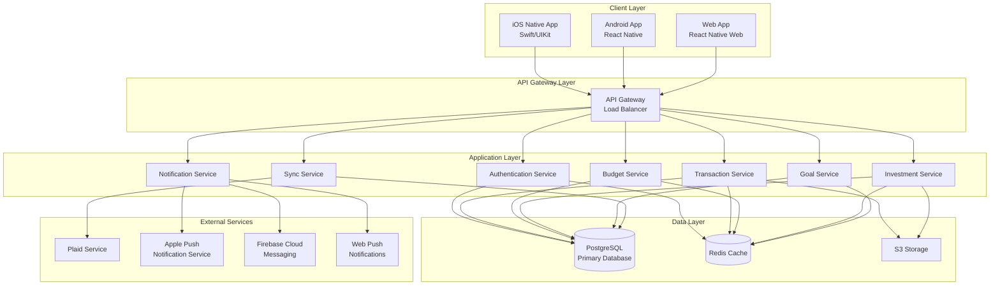

## 2.2 Component Architecture

### 2.2.1 Client Applications

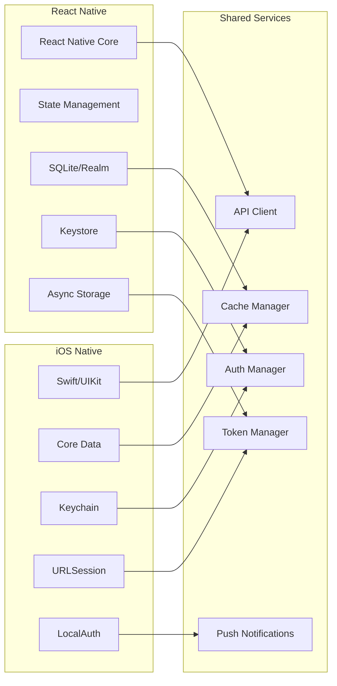

## 2.3 Data Flow Architecture

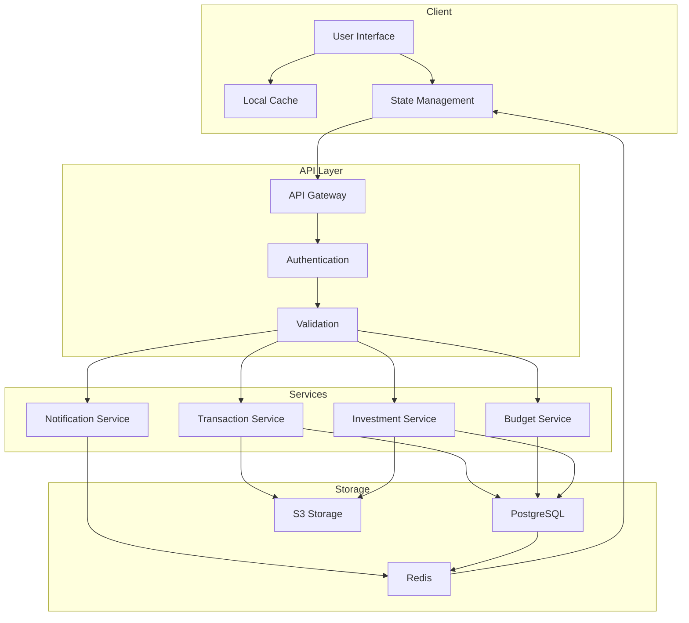

## 2.4 Security Architecture

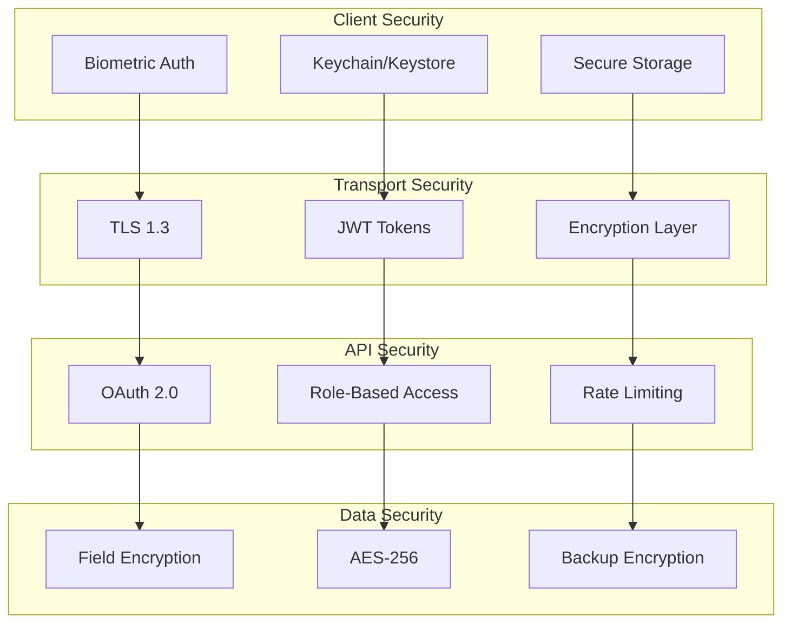

## 2.5 Infrastructure Architecture

### 2.5.1 Production Environment

- Load Balancer: AWS Application Load Balancer
- Application Servers: Kubernetes cluster with auto-scaling
- Database: Amazon RDS PostgreSQL with read replicas
- Cache: Amazon ElastiCache for Redis
- Storage: Amazon S3 with cross-region replication
- CDN: Amazon CloudFront for static assets
- Monitoring: Amazon CloudWatch and Prometheus
- Logging: ELK Stack (Elasticsearch, Logstash, Kibana)

### 2.5.2 Deployment Architecture

- Containerization: Docker
- Orchestration: Kubernetes
- CI/CD: Jenkins/GitHub Actions
- Infrastructure as Code: Terraform
- Configuration Management: Ansible
- Secret Management: HashiCorp Vault
- Service Mesh: Istio

### 2.5.3 Scalability Architecture

- Horizontal scaling for application services
- Database read replicas for query optimization
- Redis cluster for distributed caching
- CDN for static content delivery
- Message queuing for asynchronous processing
- Event-driven architecture for real-time updates

### 2.5.4 Availability Architecture

- Multi-AZ deployment
- Automated failover for database and cache
- Circuit breakers for external service dependencies
- Rate limiting and throttling
- Health monitoring and auto-recovery
- Disaster recovery with cross-region backup

# 3. System Components Architecture

## 3.1 Component Diagrams

### 3.1.1 Core System Components

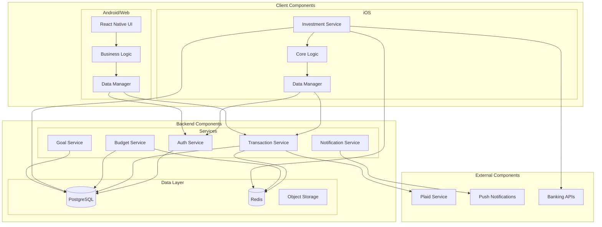

### 3.1.2 Service Component Details

| Component | Primary Responsibilities | Dependencies |
|-----------|------------------------|--------------|
| Auth Service | User authentication, session management, token handling | Redis, PostgreSQL |
| Transaction Service | Transaction processing, categorization, sync | PostgreSQL, Plaid, Redis |
| Budget Service | Budget calculations, alerts, tracking | PostgreSQL, Redis |
| Investment Service | Portfolio tracking, performance calculations | PostgreSQL, Banking APIs |
| Goal Service | Goal tracking, progress monitoring | PostgreSQL |
| Notification Service | Alert delivery, push notifications | APNS, Firebase CM, Web Push |

## 3.2 Sequence Diagrams

### 3.2.1 User Authentication Flow

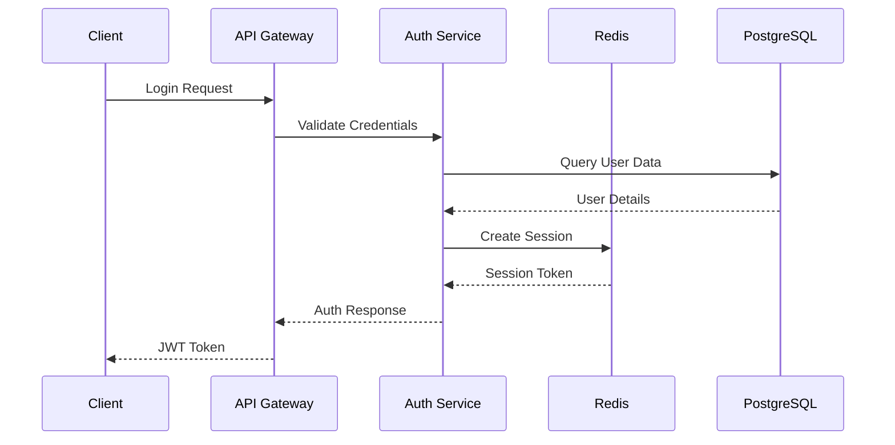

### 3.2.2 Transaction Sync Flow

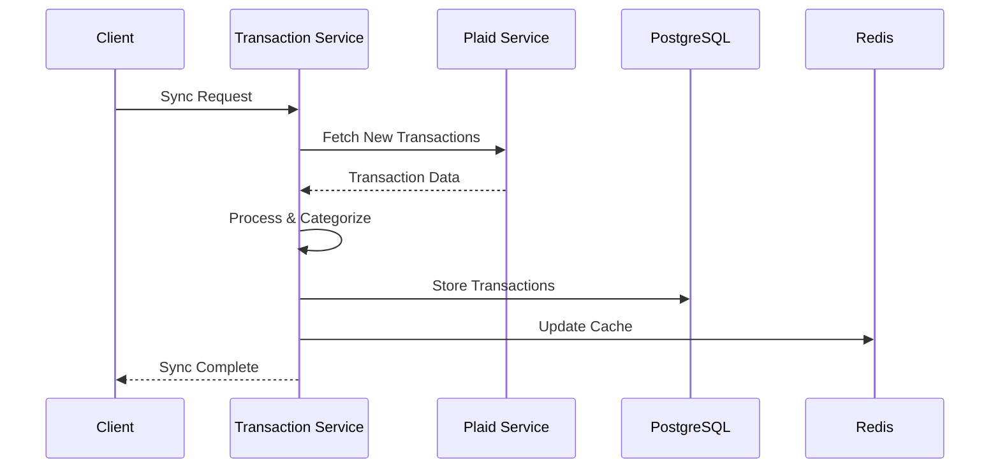

## 3.3 Data Flow Diagrams

### 3.3.1 Core Data Flows

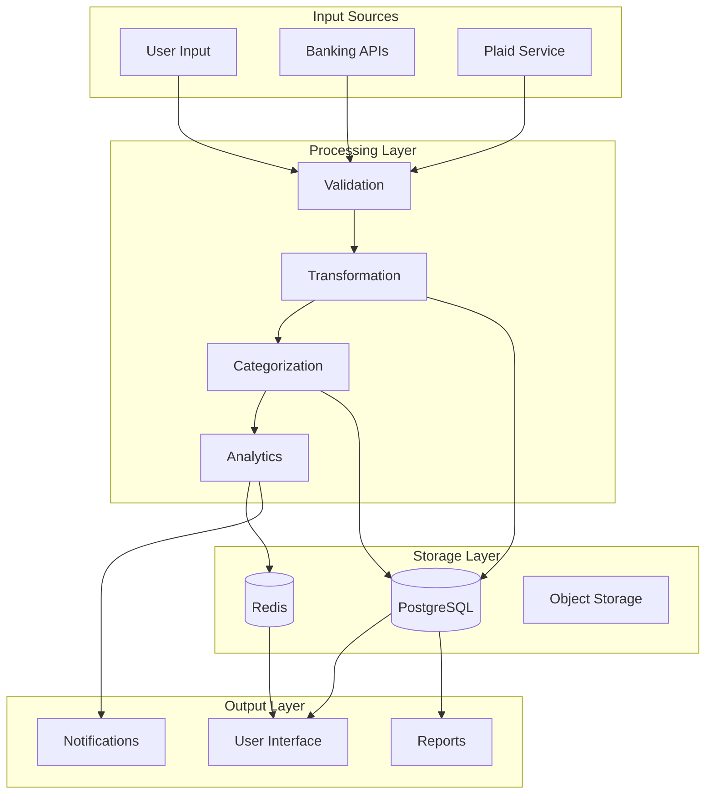

### 3.3.2 Data Flow Matrix

| Source | Processor | Storage | Consumer |
|--------|-----------|----------|-----------|
| User Input | Validation Service | PostgreSQL | UI Components |
| Banking APIs | Transform Service | Redis Cache | Reports Engine |
| Plaid API | Category Service | S3 Storage | Notification System |
| Transaction Data | Analytics Engine | - | Mobile/Web Clients |
| Budget Data | Goal Tracker | - | Alert System |

### 3.3.3 Real-time Data Flows

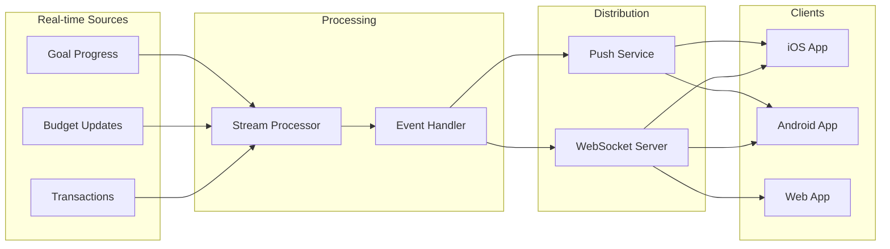

# 4. Technology Stack

## 4.1 Programming Languages

| Platform | Language | Justification |
|----------|----------|---------------|
| iOS | Swift 5.0+ | Native performance, modern syntax, strong type safety, and seamless iOS SDK integration |
| Android/Web | TypeScript/JavaScript | Cross-platform development with React Native, type safety, and extensive ecosystem |
| Backend | Python 3.9+ | Rapid development, extensive libraries, and strong data processing capabilities |
| Infrastructure | HCL (Terraform) | Infrastructure as code for cloud resource management |

## 4.2 Frameworks and Libraries

### 4.2.1 Mobile Development

| Platform | Framework/Library | Purpose |
|----------|------------------|---------|
| iOS | UIKit/SwiftUI | Native UI components and layouts |
| iOS | Combine | Reactive programming and data flow |
| iOS | Core Data | Local data persistence |
| Android/Web | React Native | Cross-platform UI development |
| Android/Web | React Native Web | Web platform support |
| Shared | Redux Toolkit | State management |
| Shared | React Navigation | Navigation management |

### 4.2.2 Backend Development

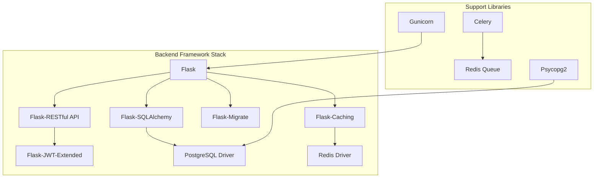

## 4.3 Databases

### 4.3.1 Primary Storage

| Database | Purpose | Implementation |
|----------|---------|----------------|
| PostgreSQL | Primary data store | Amazon RDS with read replicas |
| Redis | Caching and session management | Amazon ElastiCache |
| S3 | Document and file storage | Amazon S3 with versioning |

### 4.3.2 Client Storage

| Platform | Storage Solution | Purpose |
|----------|------------------|---------|
| iOS | Core Data | Local data persistence |
| iOS | Keychain | Secure credential storage |
| Android | SQLite/Realm | Local data persistence |
| Android | Keystore | Secure credential storage |
| Web | IndexedDB | Local data persistence |

## 4.4 Third-Party Services

```mermaid
flowchart LR
    subgraph External Services
        direction TB
        P[Plaid API] --> FI[Financial Institution Integration]
        AWS[AWS Services] --> S3[Storage]
        AWS --> RDS[Database]
        AWS --> EC[ElastiCache]
        
        N[Notification Services] --> APNS[Apple Push]
        N --> FCM[Firebase Cloud Messaging]
        N --> WP[Web Push]
    end

    subgraph Security Services
        Auth[Authentication]
        Enc[Encryption]
        KM[Key Management]
    end

    subgraph Monitoring
        Log[Logging]
        Met[Metrics]
        Trace[Tracing]
    end

    External Services --> Security Services
    External Services --> Monitoring
```

### 4.4.1 Cloud Services (AWS)

| Service | Purpose |
|---------|---------|
| ECS/EKS | Container orchestration |
| RDS | Managed PostgreSQL |
| ElastiCache | Redis caching |
| S3 | Object storage |
| CloudFront | CDN |
| Route 53 | DNS management |
| CloudWatch | Monitoring and logging |

### 4.4.2 Financial Services

| Service | Purpose |
|---------|---------|
| Plaid | Financial data aggregation |
| Stripe | Payment processing (future) |
| Banking APIs | Direct institution integration |

### 4.4.3 Development Services

| Service | Purpose |
|---------|---------|
| GitHub Actions | CI/CD pipeline |
| Docker Hub | Container registry |
| Sentry | Error tracking |
| DataDog | Application monitoring |

# 5. SYSTEM DESIGN

## 5.1 USER INTERFACE DESIGN

### 5.1.1 Mobile Navigation Structure

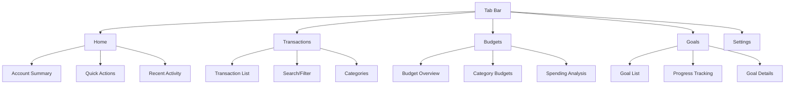

### 5.1.2 Screen Layouts

| Screen | Components | Interactions |
|--------|------------|--------------|
| Dashboard | Account Cards, Budget Summary, Recent Transactions | Pull-to-refresh, Card tap navigation |
| Transaction List | Search bar, Filter chips, Transaction rows | Infinite scroll, Swipe actions |
| Budget View | Progress circles, Category list, Alert badges | Category drill-down, Alert management |
| Goal Details | Progress bar, Timeline, Linked accounts | Goal editing, Account linking |

## 5.2 DATABASE DESIGN

### 5.2.1 Schema Design

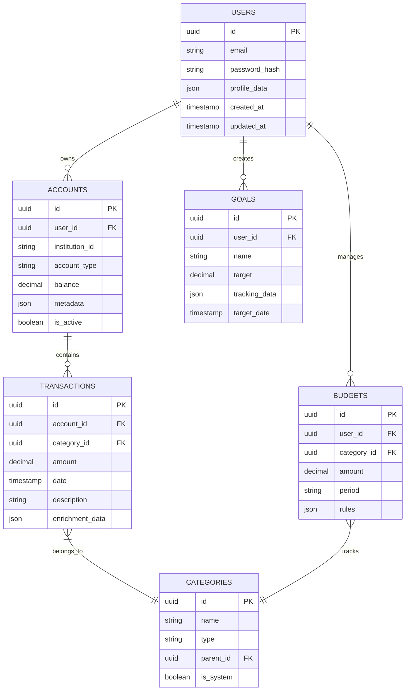

### 5.2.2 Database Indices

| Table | Index | Type | Purpose |
|-------|-------|------|---------|
| users | email_idx | UNIQUE | Email lookup |
| transactions | account_date_idx | BTREE | Transaction filtering |
| transactions | category_date_idx | BTREE | Category analysis |
| budgets | user_period_idx | BTREE | Budget tracking |
| accounts | user_active_idx | BTREE | Active account lookup |

## 5.3 API DESIGN

### 5.3.1 REST API Endpoints

| Endpoint | Method | Purpose | Request/Response |
|----------|--------|---------|------------------|
| /api/v1/auth | POST | Authentication | JWT token exchange |
| /api/v1/accounts | GET | Account listing | Paginated account list |
| /api/v1/transactions | GET | Transaction query | Filtered transactions |
| /api/v1/budgets | POST | Budget creation | Budget configuration |
| /api/v1/goals | PUT | Goal updates | Goal progress data |

### 5.3.2 WebSocket Events

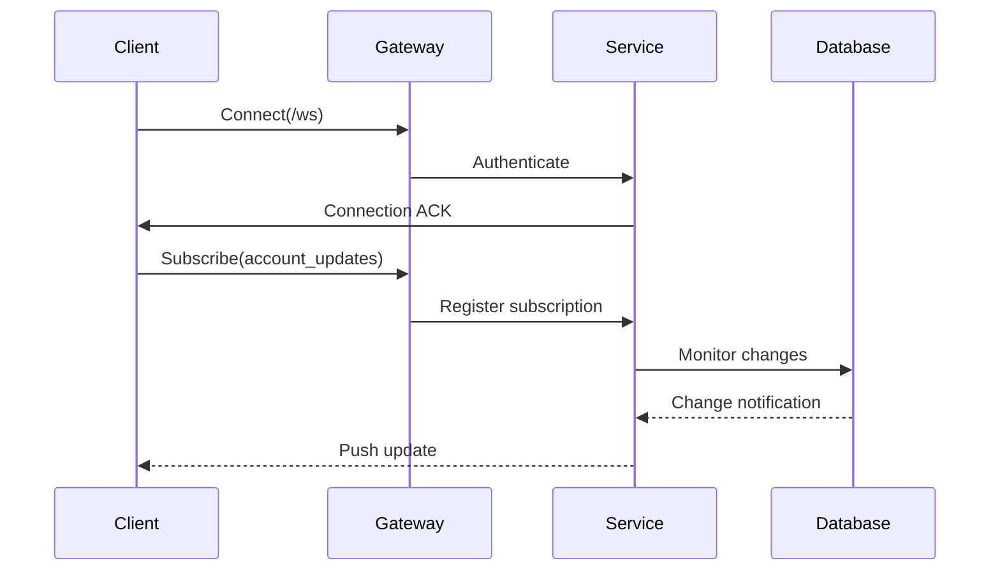

### 5.3.3 API Response Structure

| Component | Type | Description |
|-----------|------|-------------|
| status | number | HTTP status code |
| data | object | Response payload |
| meta | object | Pagination/filtering metadata |
| errors | array | Error details if applicable |

### 5.3.4 Real-time Sync Protocol

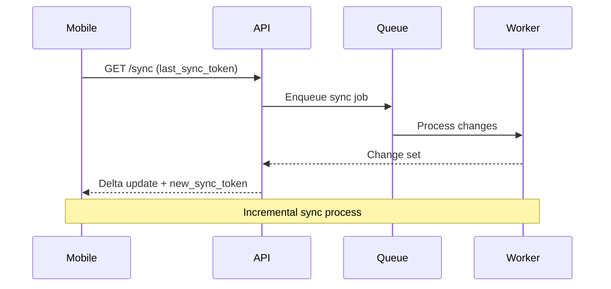

## 5.4 SECURITY DESIGN

### 5.4.1 Authentication Flow

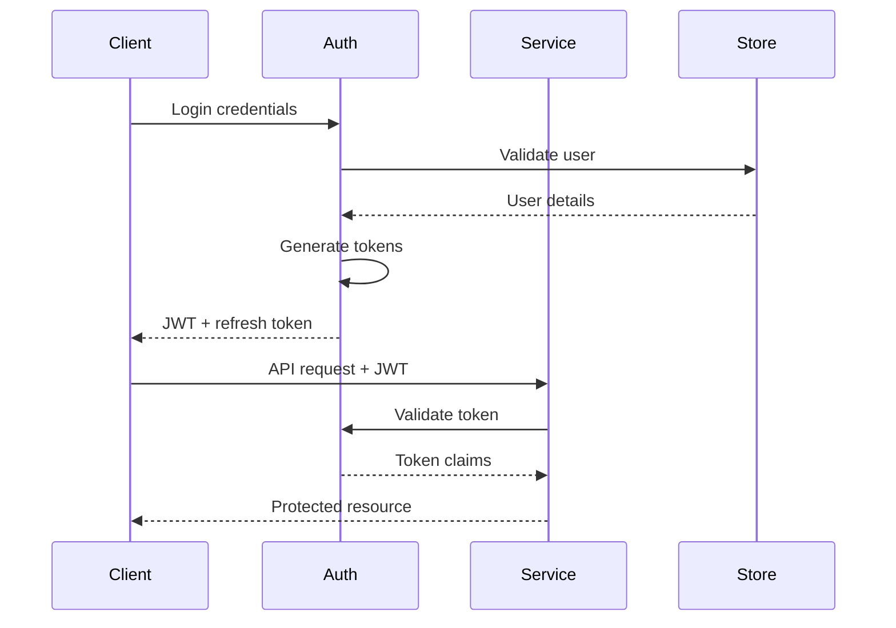

### 5.4.2 Data Protection

| Layer | Protection Mechanism | Implementation |
|-------|---------------------|----------------|
| Transport | TLS 1.3 | Mandatory HTTPS |
| Storage | AES-256 | Field-level encryption |
| Client | Keychain/Keystore | Secure credential storage |
| API | OAuth 2.0 + PKCE | Authorization flow |
| Database | Row-level security | PostgreSQL RLS policies |

# 5.1 USER INTERFACE DESIGN

## 5.1.1 Common UI Elements Key

```
Icons:
[?] - Help/Information tooltip
[$] - Financial transaction/amount
[i] - Information
[+] - Add new item
[x] - Close/Delete
[<] [>] - Navigation
[^] - Upload/Sync
[#] - Dashboard menu
[@] - User profile
[!] - Alert/Warning
[=] - Settings menu
[*] - Favorite/Important

Interactive Elements:
[ ] - Checkbox
( ) - Radio button
[Button] - Clickable button
[...] - Text input field
[====] - Progress bar
[v] - Dropdown menu
```

## 5.1.2 Dashboard Layout

```
+----------------------------------------------------------+
|  [@] Profile    [#] Dashboard    [$] Accounts    [=] Menu  |
+----------------------------------------------------------+
|                                                           |
|  Net Worth: $25,432.89 [?]        [^] Last sync: 2m ago   |
|  [==============================] +75% from last month     |
|                                                           |
|  +------------------------+  +-------------------------+   |
|  | Accounts Summary    [>]|  | Monthly Budget      [>]|   |
|  |                        |  |                         |   |
|  | Checking:   $2,341.22  |  | [===========] 65%      |   |
|  | Savings:    $8,760.45  |  | $1,234 of $1,900 used  |   |
|  | Credit:    -$1,230.67  |  | [!] Near budget limit  |   |
|  +------------------------+  +-------------------------+   |
|                                                           |
|  +------------------------+  +-------------------------+   |
|  | Recent Activity    [>] |  | Goals              [>] |   |
|  |                        |  |                         |   |
|  | [$] Amazon    -$45.23  |  | Vacation Fund          |   |
|  | [$] Salary  +$2,400.00 |  | [==========] 50%       |   |
|  | [$] Target    -$89.99  |  | $2,500 of $5,000      |   |
|  +------------------------+  +-------------------------+   |
+----------------------------------------------------------+
|  [Home]  [Transactions]  [Budgets]  [Goals]  [Insights]   |
+----------------------------------------------------------+
```

## 5.1.3 Transaction List View

```
+----------------------------------------------------------+
|  Transactions                                    [+ Add]   |
+----------------------------------------------------------+
|  [...................] Search    [v] Filter    [v] Sort    |
|                                                           |
|  Today                                                    |
|  +------------------------------------------------------+
|  | [$] Grocery Store                         -$123.45    |
|  | Category: [v] Food & Dining                           |
|  | Notes: [...........................] [Save] [x]        |
|  +------------------------------------------------------+
|  | [$] Gas Station                           -$45.67     |
|  | Category: [v] Transportation                          |
|  +------------------------------------------------------+
|                                                           |
|  Yesterday                                                |
|  +------------------------------------------------------+
|  | [$] Monthly Salary                      +$3,400.00    |
|  | Category: [v] Income                     [*] Recurring |
|  +------------------------------------------------------+
|  | [$] Netflix                               -$15.99     |
|  | Category: [v] Entertainment               [*] Recurring|
|  +------------------------------------------------------+
+----------------------------------------------------------+
```

## 5.1.4 Budget Creation/Edit View

```
+----------------------------------------------------------+
|  Create Budget                                            |
+----------------------------------------------------------+
|                                                           |
|  Budget Name: [............................]              |
|                                                           |
|  Amount: [$][..................] [v] Monthly              |
|                                                           |
|  Category Assignment:                                     |
|  +------------------------+  +-------------------------+   |
|  | Available Categories   |  | Selected Categories     |   |
|  | [ ] Food & Dining     |  | [x] Transportation      |   |
|  | [ ] Entertainment     |  | [x] Shopping            |   |
|  | [ ] Bills & Utilities |  | [x] Healthcare          |   |
|  +------------------------+  +-------------------------+   |
|                                                           |
|  Alert Settings:                                          |
|  ( ) Alert at 75% of budget                              |
|  ( ) Alert at 90% of budget                              |
|  ( ) Custom: [...]%                                      |
|                                                           |
|  [!] Notifications: [ ] Email  [ ] Push  [ ] SMS         |
|                                                           |
|         [Cancel]                    [Save Budget]         |
+----------------------------------------------------------+
```

## 5.1.5 Investment Portfolio View

```
+----------------------------------------------------------+
|  Investment Portfolio                         [^ Refresh]  |
+----------------------------------------------------------+
|  Total Value: $45,678.90        +12.3% All Time           |
|                                                           |
|  +------------------------+  +-------------------------+   |
|  | Asset Allocation    [?]|  | Performance         [?]|   |
|  |  [Pie Chart Visual]    |  |  [Line Graph Visual]   |   |
|  |                        |  |                         |   |
|  | Stocks:    65%         |  | 1D:  +0.5%             |   |
|  | Bonds:     25%         |  | 1M:  +2.3%             |   |
|  | Cash:      10%         |  | 1Y:  +8.7%             |   |
|  +------------------------+  +-------------------------+   |
|                                                           |
|  Holdings                                    [v] Sort     |
|  +------------------------------------------------------+
|  | [$] AAPL - Apple Inc.                                |
|  | 10 shares @ $150.25            [====] +5.2% ($750)   |
|  +------------------------------------------------------+
|  | [$] VTI - Vanguard Total Stock                       |
|  | 25 shares @ $205.75            [====] +3.8% ($1200)  |
|  +------------------------------------------------------+
+----------------------------------------------------------+
```

## 5.1.6 Mobile-Specific Adaptations

```
+------------------+
|  [@]    [$]  [=]|
+------------------+
| Net Worth        |
| $25,432.89      |
| [=============] |
|                 |
| +Quick Actions+ |
| [+] Add Trans   |
| [^] Sync Now    |
| [!] Alerts (2)  |
|                 |
| Recent Activity |
| [-] Amazon      |
| [-] Target      |
| [>] View All    |
|                 |
| Budget Status   |
| [=========>]    |
| 65% of monthly  |
| [>] Details     |
+------------------+
| [#] [+] [$] [@] |
+------------------+
```

## 5.1.7 Platform-Specific Implementation Notes

### iOS (Native Swift)
- Implement using UIKit/SwiftUI components
- Follow iOS Human Interface Guidelines
- Support Dark Mode
- Implement native gestures (swipe, long press)
- Use SF Symbols for icons

### Android (React Native)
- Follow Material Design guidelines
- Use React Native Paper components
- Implement Material motion and transitions
- Support system-wide dark theme
- Use platform-specific navigation patterns

### Web (React Native Web)
- Responsive design with breakpoints
- Progressive enhancement for desktop features
- Keyboard navigation support
- Cross-browser compatibility
- Support for PWA installation

# 6. SECURITY CONSIDERATIONS

## 6.1 AUTHENTICATION AND AUTHORIZATION

### 6.1.1 Authentication Flow

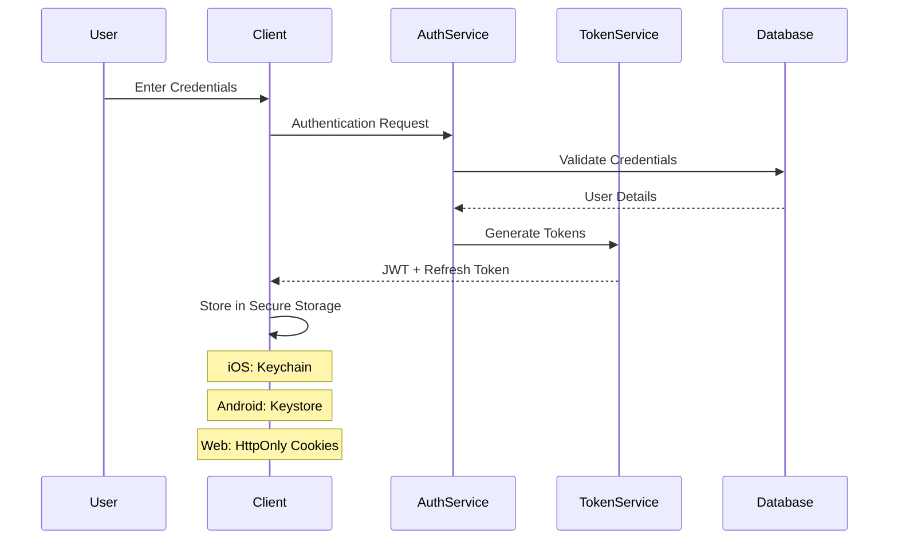

### 6.1.2 Authorization Matrix

| Role | Account Management | Transaction Data | Budget Management | Investment Data | Admin Functions |
|------|-------------------|------------------|-------------------|-----------------|-----------------|
| User | Own accounts only | Own transactions | Own budgets | Own portfolios | None |
| Premium User | Own accounts only | Own transactions + Export | Own budgets + Templates | Own portfolios + Analysis | None |
| Admin | View all | View all | View all | View all | Full access |
| Support | Limited view | Limited view | None | None | Limited access |

## 6.2 DATA SECURITY

### 6.2.1 Encryption Implementation

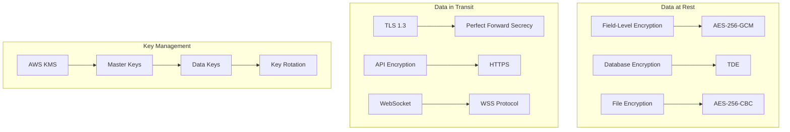

### 6.2.2 Sensitive Data Handling

| Data Type | Storage Method | Encryption | Access Control |
|-----------|---------------|------------|----------------|
| Financial Credentials | Platform Secure Storage | AES-256 | Biometric/PIN |
| Account Numbers | Field-Level Encryption | AES-256-GCM | Role-Based |
| Transaction Data | Database Encryption | TDE | User-Based |
| Authentication Tokens | Memory/Secure Storage | Platform-Specific | Session-Based |
| Personal Information | Field-Level Encryption | AES-256-GCM | Role-Based |

## 6.3 SECURITY PROTOCOLS

### 6.3.1 Security Standards Compliance

| Standard | Implementation | Verification |
|----------|---------------|--------------|
| OWASP Mobile Top 10 | Security Controls | Annual Audit |
| PSD2 | Strong Customer Authentication | Certification |
| GDPR | Data Protection Measures | Regular Assessment |
| SOC 2 Type II | Security Controls | Annual Audit |
| NIST Cybersecurity | Framework Implementation | Quarterly Review |

### 6.3.2 Security Monitoring and Response

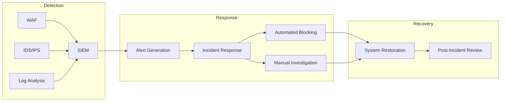

### 6.3.3 Security Controls

| Control Type | Implementation | Purpose |
|-------------|----------------|----------|
| Rate Limiting | 100 requests/minute | Prevent brute force |
| Session Management | 24-hour JWT expiry | Access control |
| IP Filtering | Geofencing | Access restriction |
| Audit Logging | Comprehensive events | Tracking and compliance |
| Input Validation | Server-side validation | Prevent injection attacks |
| Output Encoding | Context-specific encoding | Prevent XSS |
| Error Handling | Generic error messages | Prevent information disclosure |

### 6.3.4 Platform-Specific Security

| Platform | Security Measure | Implementation |
|----------|-----------------|----------------|
| iOS | App Transport Security | Mandatory HTTPS |
| iOS | Keychain Services | Credential storage |
| Android | Network Security Config | Certificate pinning |
| Android | SafetyNet Attestation | Device integrity |
| Web | CSP Headers | XSS prevention |
| Web | CORS Policy | Resource access control |
| All | Certificate Pinning | MITM prevention |

### 6.3.5 Backup and Recovery Security

```mermaid
flowchart TD
    subgraph Backup Security
        A[Encrypted Backups] --> B[Secure Transport]
        B --> C[Secure Storage]
        C --> D[Access Controls]
    end

    subgraph Recovery Procedures
        E[Disaster Recovery] --> F[Secure Restoration]
        F --> G[Data Validation]
        G --> H[Access Verification]
    end

    subgraph Monitoring
        I[Backup Monitoring] --> J[Integrity Checks]
        J --> K[Security Audits]
        K --> L[Compliance Verification]
    end
```

# 7. INFRASTRUCTURE

## 7.1 DEPLOYMENT ENVIRONMENT

```mermaid
flowchart TB
    subgraph Production Environment
        LB[AWS Application Load Balancer]
        EKS[Amazon EKS]
        RDS[(Amazon RDS)]
        EC[Amazon ElastiCache]
        S3[Amazon S3]
        CF[CloudFront CDN]
        
        LB --> EKS
        EKS --> RDS
        EKS --> EC
        EKS --> S3
        CF --> S3
    end

    subgraph Staging Environment
        SLB[Staging Load Balancer]
        SEKS[Staging EKS]
        SRDS[(Staging RDS)]
        SEC[Staging ElastiCache]
        
        SLB --> SEKS
        SEKS --> SRDS
        SEKS --> SEC
    end

    subgraph Development Environment
        DLB[Dev Load Balancer]
        DEKS[Dev EKS]
        DRDS[(Dev RDS)]
        DEC[Dev ElastiCache]
        
        DLB --> DEKS
        DEKS --> DRDS
        DEKS --> DEC
    end
```

### Environment Specifications

| Environment | Purpose | Scaling | Redundancy |
|-------------|---------|---------|------------|
| Production | Live user traffic | Auto-scaling (2-20 nodes) | Multi-AZ deployment |
| Staging | Pre-release testing | Fixed (2 nodes) | Single-AZ |
| Development | Development testing | Fixed (1 node) | Single-AZ |

## 7.2 CLOUD SERVICES

| Service | Usage | Justification |
|---------|-------|---------------|
| Amazon EKS | Container orchestration | Native Kubernetes support, scalability |
| Amazon RDS (PostgreSQL) | Primary database | Managed service, automatic backups |
| Amazon ElastiCache | Redis caching | In-memory performance, session management |
| Amazon S3 | Object storage | Durability, cost-effective storage |
| CloudFront | CDN | Global content delivery, edge caching |
| AWS Certificate Manager | SSL/TLS certificates | Managed certificate lifecycle |
| AWS KMS | Key management | Encryption key management |
| AWS CloudWatch | Monitoring | Unified monitoring and alerting |

## 7.3 CONTAINERIZATION

```mermaid
flowchart LR
    subgraph Docker Images
        API[API Service]
        Auth[Auth Service]
        Sync[Sync Service]
        Worker[Worker Service]
    end

    subgraph Base Images
        Node[Node.js]
        Python[Python]
        Redis[Redis]
        Nginx[Nginx]
    end

    Node --> API
    Python --> Auth
    Python --> Sync
    Python --> Worker
    Nginx --> API
```

### Container Specifications

| Service | Base Image | Resources |
|---------|------------|-----------|
| API Service | node:18-alpine | 1CPU, 2GB RAM |
| Auth Service | python:3.9-slim | 0.5CPU, 1GB RAM |
| Sync Service | python:3.9-slim | 1CPU, 2GB RAM |
| Worker Service | python:3.9-slim | 2CPU, 4GB RAM |

## 7.4 ORCHESTRATION

```mermaid
flowchart TB
    subgraph Kubernetes Cluster
        direction TB
        subgraph Services
            API[API Pods]
            Auth[Auth Pods]
            Sync[Sync Pods]
            Worker[Worker Pods]
        end

        subgraph Infrastructure
            ING[Ingress Controller]
            HPA[Horizontal Pod Autoscaler]
            SM[Service Mesh]
        end

        ING --> API
        ING --> Auth
        HPA --> Services
        SM --> Services
    end
```

### Kubernetes Configuration

| Component | Configuration | Purpose |
|-----------|--------------|----------|
| Ingress | NGINX Ingress Controller | Route external traffic |
| HPA | CPU: 70%, Memory: 80% | Auto-scaling triggers |
| Service Mesh | Istio | Traffic management, security |
| Network Policy | Calico | Pod network security |

## 7.5 CI/CD PIPELINE

```mermaid
flowchart LR
    subgraph Development
        Git[GitHub]
        Build[Build Stage]
        Test[Test Stage]
    end

    subgraph Deployment
        Art[Artifact Registry]
        Stg[Staging Deploy]
        Prod[Production Deploy]
    end

    Git --> Build
    Build --> Test
    Test --> Art
    Art --> Stg
    Stg --> Prod
```

### Pipeline Stages

| Stage | Tools | Actions |
|-------|-------|---------|
| Source Control | GitHub | Code versioning, PR reviews |
| Build | GitHub Actions | Docker image builds |
| Test | Jest, PyTest | Unit/Integration tests |
| Security Scan | SonarQube, Snyk | Code/dependency scanning |
| Artifact Storage | AWS ECR | Container image registry |
| Deployment | ArgoCD | GitOps deployment |
| Monitoring | Prometheus/Grafana | Performance monitoring |

### Deployment Strategy

| Environment | Strategy | Rollback |
|-------------|----------|----------|
| Staging | Blue/Green | Automatic |
| Production | Canary | Manual approval |
| Hotfix | Rolling update | Automatic |

# APPENDICES

## A. ADDITIONAL TECHNICAL INFORMATION

### A.1 Development Environment Setup

```mermaid
flowchart LR
    subgraph iOS Development
        XC[Xcode 14+]
        CP[CocoaPods]
        SW[Swift 5.0+]
        SIM[iOS Simulator]
    end

    subgraph React Native Development
        ND[Node.js]
        RN[React Native CLI]
        MT[Metro Bundler]
        AN[Android Studio]
    end

    subgraph Common Tools
        GIT[Git]
        VSC[VS Code]
        PG[PostgreSQL]
        RD[Redis]
    end

    XC --> SW
    SW --> CP
    CP --> SIM

    ND --> RN
    RN --> MT
    MT --> AN

    GIT --> VSC
    VSC --> PG
    PG --> RD
```

### A.2 Code Quality Standards

| Category | Tool | Purpose | Configuration |
|----------|------|---------|---------------|
| Swift | SwiftLint | Code style enforcement | .swiftlint.yml |
| TypeScript | ESLint | Static code analysis | .eslintrc |
| Python | Black | Code formatting | pyproject.toml |
| General | SonarQube | Code quality metrics | sonar-project.properties |

### A.3 Error Handling Codes

| Code Range | Category | Description |
|------------|----------|-------------|
| 1000-1999 | Authentication | User authentication and authorization errors |
| 2000-2999 | Data Sync | Account synchronization and update errors |
| 3000-3999 | Transaction | Transaction processing and categorization errors |
| 4000-4999 | Budget | Budget creation and tracking errors |
| 5000-5999 | Investment | Investment account and portfolio errors |

## B. GLOSSARY

| Term | Definition |
|------|------------|
| AES-256 | Advanced Encryption Standard with 256-bit key length for secure data encryption |
| Core Data | Apple's framework for managing object lifecycle and persistence |
| Keychain Services | iOS secure storage system for sensitive user data |
| Metro Bundler | JavaScript bundler for React Native applications |
| Pod | Package management unit for iOS development using CocoaPods |
| Realm | Mobile database solution for React Native applications |
| SQLite | Self-contained, serverless transactional SQL database engine |
| SwiftUI | Declarative UI framework for iOS development |
| URLSession | Apple's API for downloading and uploading data |
| WebSocket | Protocol providing full-duplex communication channels over TCP |

## C. ACRONYMS

| Acronym | Full Form |
|---------|-----------|
| AES | Advanced Encryption Standard |
| APNS | Apple Push Notification Service |
| CDN | Content Delivery Network |
| CI/CD | Continuous Integration/Continuous Delivery |
| CORS | Cross-Origin Resource Sharing |
| FCM | Firebase Cloud Messaging |
| GDPR | General Data Protection Regulation |
| HIG | Human Interface Guidelines |
| JWT | JSON Web Token |
| KMS | Key Management Service |
| OAuth | Open Authorization |
| PSD2 | Payment Services Directive 2 |
| RBAC | Role-Based Access Control |
| REST | Representational State Transfer |
| RLS | Row-Level Security |
| SDK | Software Development Kit |
| SOC | System and Organization Controls |
| SSL | Secure Sockets Layer |
| TDE | Transparent Data Encryption |
| TLS | Transport Layer Security |
| UI/UX | User Interface/User Experience |
| UUID | Universally Unique Identifier |
| WCAG | Web Content Accessibility Guidelines |
| XSS | Cross-Site Scripting |

## D. REFERENCE ARCHITECTURE PATTERNS

```mermaid
flowchart TB
    subgraph Frontend Patterns
        MVVM[MVVM Architecture]
        FLUX[Flux/Redux Pattern]
        CLEAN[Clean Architecture]
    end

    subgraph Backend Patterns
        REST[RESTful Services]
        EVENT[Event-Driven]
        CQRS[CQRS Pattern]
    end

    subgraph Data Patterns
        CACHE[Cache-Aside]
        SHARDING[Database Sharding]
        REPLICA[Read Replicas]
    end

    MVVM --> REST
    FLUX --> EVENT
    CLEAN --> CQRS

    REST --> CACHE
    EVENT --> SHARDING
    CQRS --> REPLICA
```