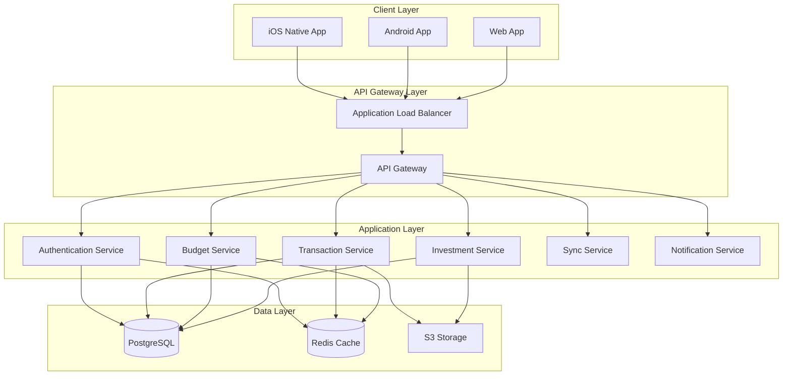
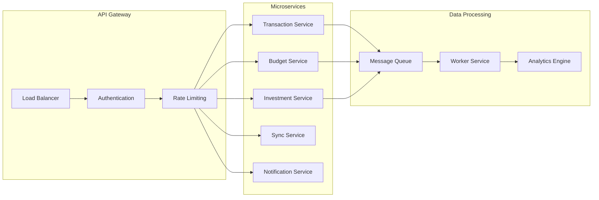
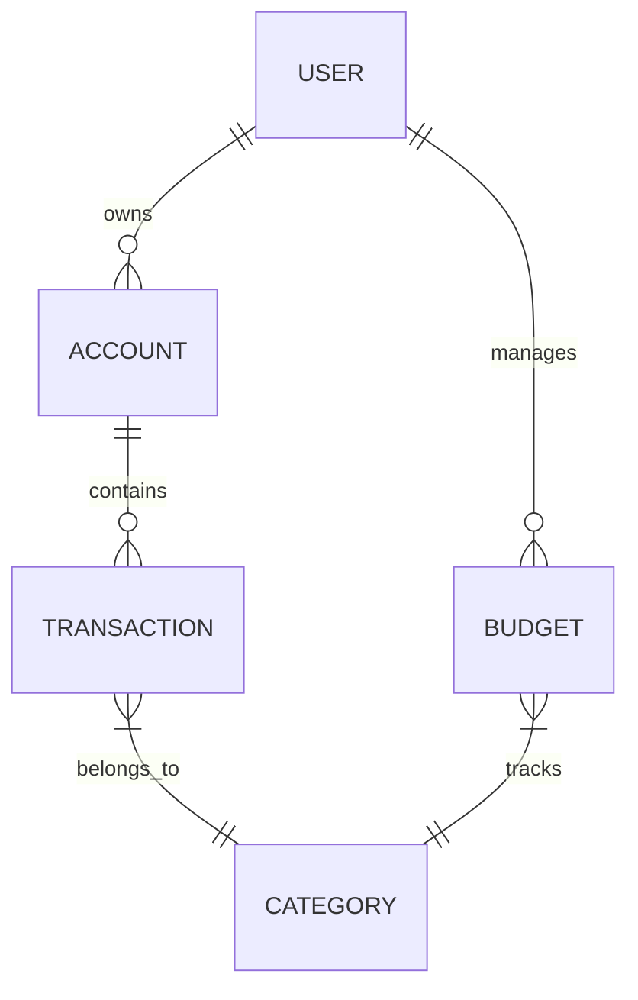
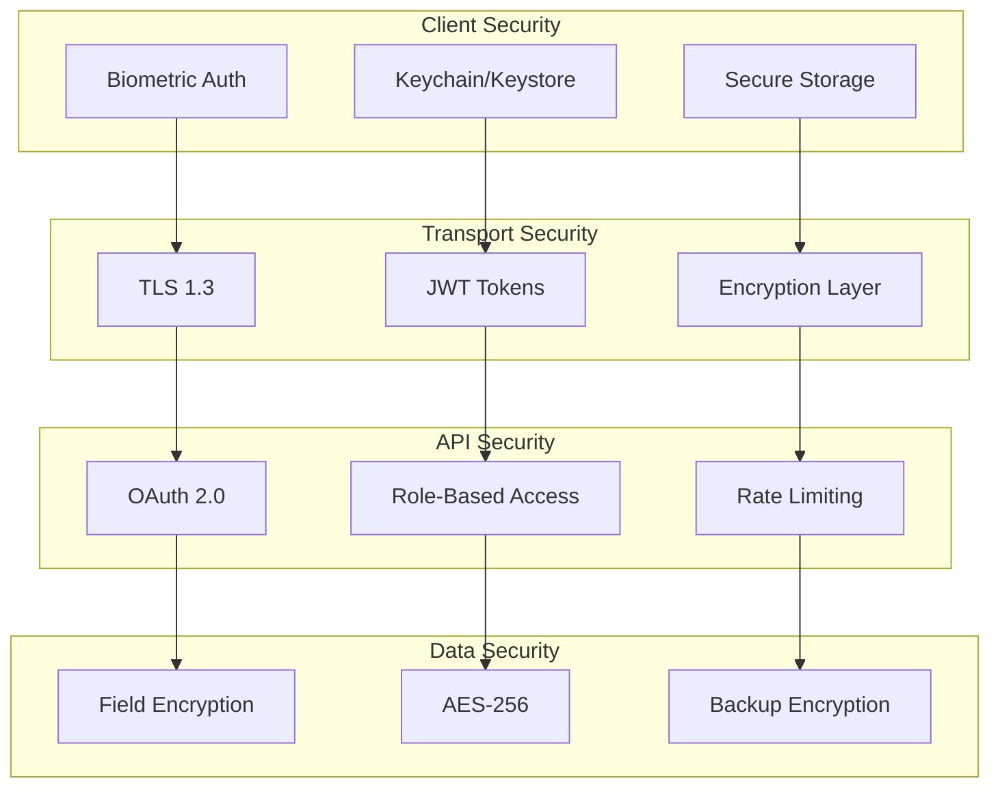
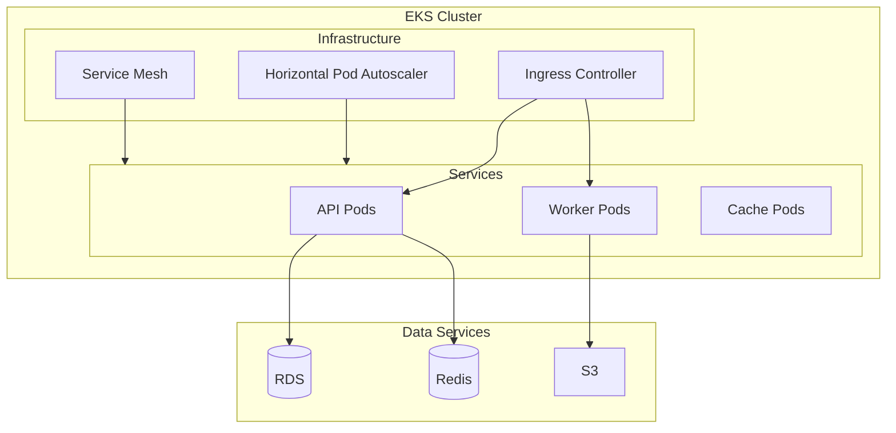
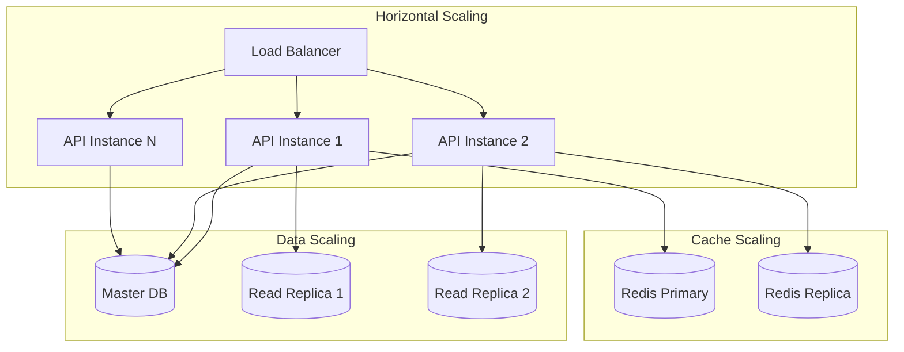
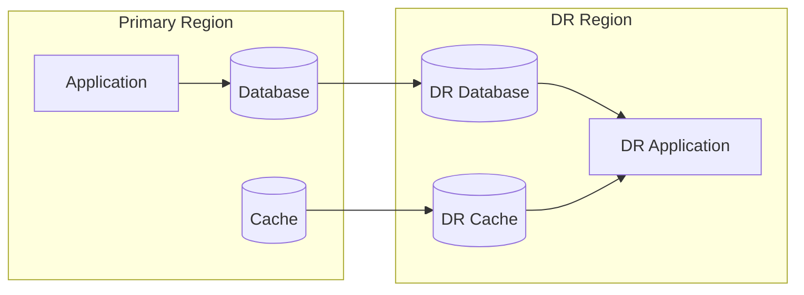

# Mint Replica Lite System Architecture Documentation

<!-- Human Tasks:
1. Review and validate AWS infrastructure configuration
2. Ensure Kubernetes cluster meets specifications
3. Verify security compliance requirements
4. Configure monitoring and alerting thresholds
5. Set up disaster recovery procedures
6. Review and approve architecture diagrams
7. Validate component interaction patterns -->

## 1. System Overview
<!-- Addresses requirement: System Architecture Documentation (2.1 High-Level Architecture Overview) -->

Mint Replica Lite is a comprehensive financial management system built with a modern, cloud-native architecture. The system consists of:

## 2. Client Architecture
<!-- Addresses requirement: Component Architecture Documentation (2.2.1 Client Applications) -->

### 2.1 iOS Application Architecture
- Native Swift implementation using UIKit/SwiftUI
- MVVM architecture pattern
- Core Data for local persistence
- Keychain for secure storage
- Combine framework for reactive programming

### 2.2 Android Application Architecture
- React Native implementation
- Redux for state management
- SQLite/Realm for local storage
- Android Keystore for secure storage
- React Navigation for routing

### 2.3 Web Application Architecture
- React Native Web implementation
- Redux for state management
- IndexedDB for local storage
- Session storage for secure data
- React Router for navigation

## 3. Backend Architecture
<!-- Addresses requirement: Data Flow Documentation (2.3 Data Flow Architecture) -->

## 4. Data Architecture
<!-- Addresses requirement: Data Flow Documentation (2.3 Data Flow Architecture) -->

### 4.1 Data Models

### 4.2 Database Architecture
- Primary Database: PostgreSQL RDS
  - Multi-AZ deployment
  - Read replicas for scaling
  - Point-in-time recovery
  - Automated backups

### 4.3 Caching Strategy
- Redis Cache Layer
  - Session management
  - API response caching
  - Real-time data updates
  - Distributed locking

## 5. Security Architecture
<!-- Addresses requirement: Security Architecture Documentation (2.4 Security Architecture) -->

## 6. Infrastructure Architecture
<!-- Addresses requirement: Infrastructure Documentation (2.5 Infrastructure Architecture) -->

### 6.1 AWS Infrastructure
- EKS for container orchestration
- RDS for database management
- ElastiCache for Redis
- S3 for object storage
- CloudFront for CDN
- Route 53 for DNS
- CloudWatch for monitoring

### 6.2 Kubernetes Architecture

## 7. Integration Architecture
<!-- Addresses requirement: Data Flow Documentation (2.3 Data Flow Architecture) -->

### 7.1 Third-party Integrations
- Financial data providers
- Payment processors
- Authentication providers
- Analytics services
- Notification services

### 7.2 API Standards
- RESTful API design
- OpenAPI specification
- Versioning strategy
- Rate limiting
- Authentication/Authorization

## 8. Performance Architecture
<!-- Addresses requirement: Infrastructure Documentation (2.5 Infrastructure Architecture) -->

### 8.1 Performance Goals
- API response time < 200ms
- 99.9% availability
- < 1% error rate
- < 1s page load time
- Real-time sync < 5s

### 8.2 Scalability Design

## 9. Monitoring Architecture
<!-- Addresses requirement: Infrastructure Documentation (2.5 Infrastructure Architecture) -->

### 9.1 Monitoring Components
- Prometheus for metrics
- Grafana for visualization
- ELK Stack for logging
- CloudWatch for AWS resources
- Custom dashboards for KPIs

### 9.2 Alert Configuration
- Service health checks
- Performance thresholds
- Error rate monitoring
- Resource utilization
- Security events

## 10. Disaster Recovery
<!-- Addresses requirement: Infrastructure Documentation (2.5 Infrastructure Architecture) -->

### 10.1 Recovery Objectives
- RTO: 1 hour
- RPO: 5 minutes
- Multi-region backup
- Automated failover
- Data replication

### 10.2 Backup Strategy
