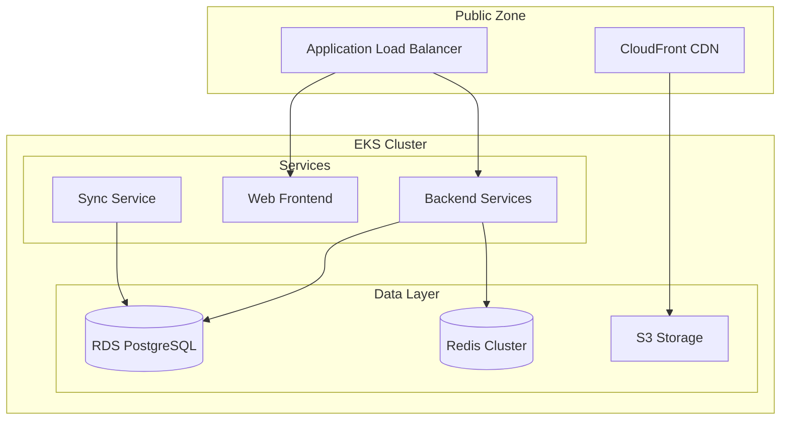
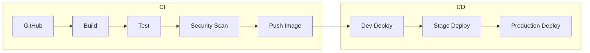

# Mint Replica Lite Deployment Documentation

<!-- Human Tasks:
1. Verify AWS credentials and access permissions are properly configured
2. Ensure Kubernetes cluster meets minimum version requirements (v1.24+)
3. Configure DNS records for all environments
4. Set up SSL certificates in AWS Certificate Manager
5. Configure backup retention policies in AWS
6. Verify HashiCorp Vault is configured for secrets management
7. Set up monitoring alerts for deployment events -->

## Infrastructure Overview

### AWS Infrastructure Components
<!-- Addresses requirement: Infrastructure Architecture (2.5.1 Production Environment) -->



### Kubernetes Cluster Architecture
<!-- Addresses requirement: Deployment Architecture (2.5.2 Deployment Architecture) -->

- Production Cluster:
  - Version: 1.24+
  - Node Groups: 3 (minimum)
  - Instance Types: t3.large (general), c5.xlarge (compute-optimized)
  - Autoscaling: 3-10 nodes per group
  - Multi-AZ deployment

- Staging Cluster:
  - Version: 1.24+
  - Node Groups: 2
  - Instance Types: t3.medium
  - Autoscaling: 2-5 nodes
  - Single-AZ deployment

### Database and Caching Setup
<!-- Addresses requirement: Scalability Architecture (2.5.3 Scalability Architecture) -->

#### RDS Configuration
- Instance: db.r5.xlarge
- Multi-AZ: Enabled
- Read Replicas: 2
- Backup Window: 02:00-03:00 UTC
- Retention Period: 30 days

#### Redis Cluster
- Node Type: cache.r5.large
- Shards: 3
- Replicas per Shard: 2
- Auto-failover: Enabled
- Maintenance Window: Sun 03:00-04:00 UTC

### Storage and CDN Configuration
- S3 Buckets:
  - Static Assets: mint-replica-static-${ENV}
  - User Data: mint-replica-data-${ENV}
  - Backups: mint-replica-backup-${ENV}
- CloudFront Distribution:
  - SSL Certificate: ACM managed
  - Edge Locations: Global
  - Cache Behaviors: Optimized for static assets

## Environment Setup

### Development Environment
```yaml
Environment: Development
Domain: dev.mintreplica.com
Resources:
  - EKS: 1 node group
  - RDS: db.t3.medium
  - Redis: cache.t3.medium
  - S3: Standard storage
```

### Staging Environment
```yaml
Environment: Staging
Domain: staging.mintreplica.com
Resources:
  - EKS: 2 node groups
  - RDS: db.r5.large
  - Redis: cache.r5.large
  - S3: Standard storage
```

### Production Environment
```yaml
Environment: Production
Domain: mintreplica.com
Resources:
  - EKS: 3 node groups
  - RDS: db.r5.xlarge
  - Redis: cache.r5.xlarge
  - S3: Standard + Intelligent Tiering
```

### Environment-specific Configurations
<!-- Addresses requirement: Deployment Architecture (2.5.2 Deployment Architecture) -->

```yaml
configurations:
  base:
    - configmap: common-config
    - secret: common-secrets
  environment_specific:
    development:
      - configmap: dev-config
      - secret: dev-secrets
    staging:
      - configmap: staging-config
      - secret: staging-secrets
    production:
      - configmap: prod-config
      - secret: prod-secrets
```

## Deployment Pipeline

### CI/CD Workflow
<!-- Addresses requirement: Deployment Architecture (2.5.2 Deployment Architecture) -->



### Build and Test Processes
```bash
# Build process
docker build -t mint-replica-backend:${VERSION} .
docker tag mint-replica-backend:${VERSION} ${ECR_REPO}/mint-replica-backend:${VERSION}

# Test execution
npm run test
npm run integration-test
npm run security-scan

# Image push
docker push ${ECR_REPO}/mint-replica-backend:${VERSION}
```

### Container Registry Management
- Registry: Amazon ECR
- Repositories:
  - mint-replica-backend
  - mint-replica-web
  - mint-replica-sync
- Lifecycle Policy:
  - Keep last 5 production tags
  - Expire untagged images after 7 days
  - Keep all images tagged as 'latest'

### Deployment Strategies
<!-- Addresses requirement: Deployment Architecture (2.5.2 Deployment Architecture) -->

- Development: Rolling update
  ```yaml
  strategy:
    type: RollingUpdate
    rollingUpdate:
      maxSurge: 1
      maxUnavailable: 0
  ```

- Staging: Blue/Green
  ```yaml
  strategy:
    type: Blue/Green
    activeService: blue
    previewService: green
    autoPromote: false
  ```

- Production: Canary
  ```yaml
  strategy:
    type: Canary
    steps:
      - setWeight: 20
      - pause: {duration: 10m}
      - setWeight: 50
      - pause: {duration: 10m}
      - setWeight: 100
  ```

## Application Deployment

### Backend Service Deployment
<!-- Addresses requirement: Deployment Architecture (2.5.2 Deployment Architecture) -->

```yaml
# Backend deployment configuration
apiVersion: apps/v1
kind: Deployment
metadata:
  name: backend-api
  namespace: mint-replica-backend
spec:
  replicas: 3
  selector:
    matchLabels:
      app: mint-replica-backend
  template:
    spec:
      containers:
        - name: backend-api
          image: ${ECR_REPO}/mint-replica-backend:${VERSION}
          resources:
            requests:
              cpu: "500m"
              memory: "512Mi"
            limits:
              cpu: "2000m"
              memory: "2Gi"
```

### Web Application Deployment
```yaml
# Web frontend deployment
apiVersion: apps/v1
kind: Deployment
metadata:
  name: web-frontend
  namespace: mint-replica-web
spec:
  replicas: 2
  template:
    spec:
      containers:
        - name: web-frontend
          image: ${ECR_REPO}/mint-replica-web:${VERSION}
          ports:
            - containerPort: 80
```

### Database Migrations
```bash
# Execute database migrations
kubectl create job --from=cronjob/db-migrate db-migrate-${VERSION}

# Verify migration status
kubectl logs job/db-migrate-${VERSION}

# Rollback procedure if needed
kubectl create job --from=cronjob/db-rollback db-rollback-${VERSION}
```

### Cache Management
```bash
# Flush cache during deployment
kubectl exec -it redis-master-0 -- redis-cli FLUSHALL

# Verify cache status
kubectl exec -it redis-master-0 -- redis-cli INFO
```

## Scaling and Management

### Horizontal Pod Autoscaling
<!-- Addresses requirement: Scalability Architecture (2.5.3 Scalability Architecture) -->

```yaml
apiVersion: autoscaling/v2
kind: HorizontalPodAutoscaler
metadata:
  name: backend-api-hpa
spec:
  scaleTargetRef:
    apiVersion: apps/v1
    kind: Deployment
    name: backend-api
  minReplicas: 2
  maxReplicas: 10
  metrics:
    - type: Resource
      resource:
        name: cpu
        target:
          type: Utilization
          averageUtilization: 70
```

### Database Scaling
```bash
# Scale up RDS instance
aws rds modify-db-instance \
    --db-instance-identifier mint-replica-db \
    --db-instance-class db.r5.2xlarge \
    --apply-immediately

# Add read replica
aws rds create-db-instance-read-replica \
    --db-instance-identifier mint-replica-reader \
    --source-db-instance-identifier mint-replica-db
```

### Cache Cluster Scaling
```bash
# Scale Redis cluster
aws elasticache modify-replication-group \
    --replication-group-id mint-replica-redis \
    --node-group-count 4 \
    --apply-immediately
```

### Load Balancer Configuration
```yaml
apiVersion: networking.k8s.io/v1
kind: Ingress
metadata:
  name: mint-replica-ingress
  annotations:
    kubernetes.io/ingress.class: "alb"
    alb.ingress.kubernetes.io/scheme: "internet-facing"
    alb.ingress.kubernetes.io/target-type: "ip"
spec:
  rules:
    - host: api.mintreplica.com
      http:
        paths:
          - path: /
            pathType: Prefix
            backend:
              service:
                name: backend-api
                port:
                  number: 80
```

## Pre-deployment Checklist

### Infrastructure Verification
- [ ] Verify AWS resource quotas
- [ ] Check Kubernetes cluster capacity
- [ ] Validate network policies
- [ ] Test load balancer health checks
- [ ] Verify SSL certificate validity

### Resource Quotas
- [ ] CPU and memory limits
- [ ] Storage quotas
- [ ] Network bandwidth
- [ ] API rate limits
- [ ] Database connections

### Configuration Validation
- [ ] Environment variables
- [ ] Secrets management
- [ ] Database credentials
- [ ] API keys and tokens
- [ ] Feature flags

### Security Scans
- [ ] Container vulnerability scan
- [ ] Dependency audit
- [ ] Infrastructure security check
- [ ] Network security validation
- [ ] Compliance verification

## Deployment Checklist

### Database Operations
- [ ] Execute database migrations
- [ ] Verify data integrity
- [ ] Check replication status
- [ ] Validate backup procedures
- [ ] Test rollback scripts

### Backend Services
- [ ] Deploy API services
- [ ] Scale backend pods
- [ ] Configure auto-scaling
- [ ] Update service endpoints
- [ ] Verify health checks

### Web Applications
- [ ] Deploy web frontend
- [ ] Update CDN configuration
- [ ] Clear cache if needed
- [ ] Verify static assets
- [ ] Test user flows

### Load Balancers
- [ ] Update routing rules
- [ ] Configure SSL termination
- [ ] Set up health checks
- [ ] Test failover scenarios
- [ ] Verify DNS propagation

## Post-deployment Checklist

### Application Metrics
- [ ] Monitor error rates
- [ ] Check response times
- [ ] Verify throughput
- [ ] Track resource usage
- [ ] Analyze user impact

### Service Verification
- [ ] Test API endpoints
- [ ] Verify database connections
- [ ] Check cache performance
- [ ] Validate authentication
- [ ] Test integrations

### Logging Pipeline
- [ ] Verify log aggregation
- [ ] Check alert configurations
- [ ] Monitor error logs
- [ ] Track audit trails
- [ ] Test log retention

### Documentation
- [ ] Update API documentation
- [ ] Record deployment notes
- [ ] Update runbooks
- [ ] Document configuration changes
- [ ] Update architecture diagrams