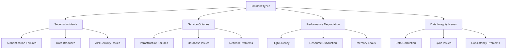
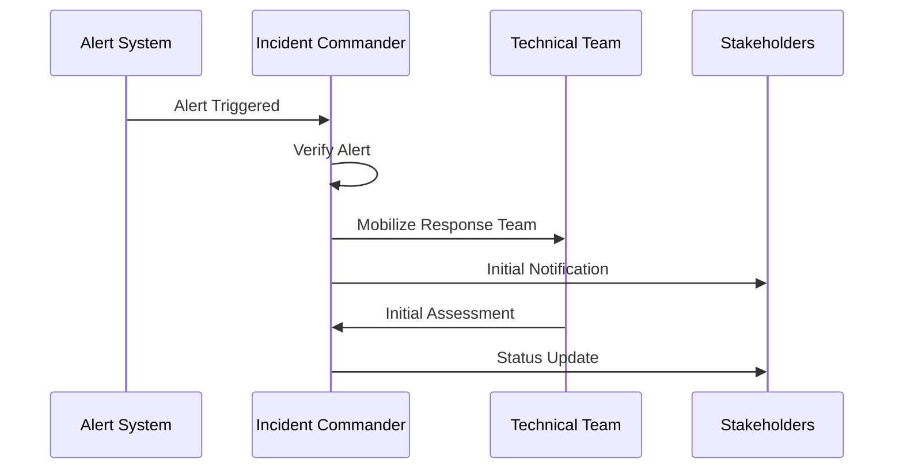
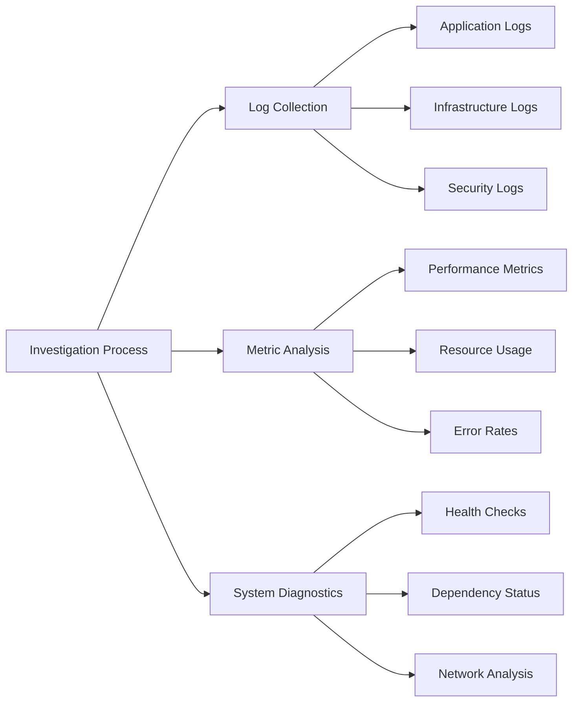

<!-- Human Tasks:
1. Verify PagerDuty integration is configured and on-call schedules are set up
2. Ensure Slack channels for incident communication are created
3. Validate access to Prometheus/Grafana dashboards for incident responders
4. Configure email distribution lists for incident notifications
5. Test incident response communication channels -->

# Mint Replica Lite Incident Response Procedures

<!-- Addresses requirement: Security Monitoring and Response (6.3.2) -->
## Overview

This document outlines the comprehensive incident response procedures for the Mint Replica Lite system. It provides structured guidelines for identifying, classifying, and responding to various types of incidents to ensure minimal service disruption and maintain system security.

## Incident Classification

### Severity Levels

#### SEV1 - Critical System-Wide Outage
- Complete system unavailability
- Data security breach
- Critical data loss or corruption
- Payment processing system failure
- Multi-region infrastructure failure

#### SEV2 - Major Functionality Impacted
- Single region availability issues
- Significant performance degradation
- Authentication system issues
- Financial data sync failures
- Critical feature unavailability

#### SEV3 - Minor Functionality Impacted
- Non-critical feature unavailability
- Minor performance issues
- Individual user account issues
- Non-critical data sync delays
- Isolated third-party integration failures

#### SEV4 - Minimal Impact
- Cosmetic issues
- Minor UI/UX problems
- Non-critical alerts
- Individual transaction sync delays
- Documentation issues

### Incident Types



## Response Procedures

<!-- Addresses requirement: High Availability (2.5.4) -->
### Initial Response

1. Alert Verification
   - Monitor Prometheus alerts in Grafana dashboard
   - Verify alert authenticity and severity
   - Check related metrics and logs
   - Confirm impact scope

2. Impact Assessment
   - Determine affected services
   - Estimate user impact
   - Identify affected regions/components
   - Assess data integrity status

3. Team Mobilization
   - Notify incident commander
   - Engage required technical teams
   - Alert stakeholders based on severity
   - Establish communication channels

4. Communication Initiation
   - Create incident channel in Slack
   - Send initial notification to stakeholders
   - Update status page
   - Begin incident logging



### Investigation

<!-- Addresses requirement: Infrastructure Security (2.1) -->
1. Log Analysis
   - Review application logs
   - Check infrastructure logs
   - Analyze security logs
   - Examine audit trails

2. Metrics Review
   - Monitor system metrics in Grafana
   - Check resource utilization
   - Review performance metrics
   - Analyze error rates

3. Root Cause Analysis
   - Identify trigger events
   - Map failure cascade
   - Document timeline
   - Determine contributing factors



### Mitigation

1. Immediate Actions
   - Implement temporary fixes
   - Enable fallback systems
   - Block security threats
   - Scale resources if needed

2. Service Restoration
   - Deploy fixes
   - Restore from backups if needed
   - Verify service health
   - Enable monitoring

3. Data Recovery
   - Validate data integrity
   - Restore corrupted data
   - Verify data consistency
   - Document data impact

4. Verification Steps
   - Test functionality
   - Verify metrics
   - Confirm resolution
   - Update documentation

## Incident Response Checklists

### Initial Response Checklist
- [ ] Acknowledge alert from Prometheus/Alertmanager
- [ ] Verify incident severity and scope
- [ ] Create incident channel in Slack
- [ ] Notify required personnel based on severity
- [ ] Begin incident documentation
- [ ] Establish communication channels
- [ ] Update status page
- [ ] Start incident timer

### Investigation Checklist
- [ ] Collect relevant logs from affected systems
- [ ] Review Prometheus metrics in Grafana
- [ ] Check system health dashboards
- [ ] Identify affected components
- [ ] Map incident timeline
- [ ] Document findings
- [ ] Update stakeholders
- [ ] Track investigation progress

### Resolution Checklist
- [ ] Implement fix or workaround
- [ ] Test solution in affected areas
- [ ] Verify through monitoring
- [ ] Update documentation
- [ ] Notify stakeholders of resolution
- [ ] Schedule post-mortem
- [ ] Document lessons learned
- [ ] Update runbooks if needed

## Communication Templates

### Initial Notification
```
INCIDENT ALERT
Severity: [SEV LEVEL]
Time Detected: [TIMESTAMP]
Impact: [BRIEF DESCRIPTION]
Current Status: Under Investigation
Next Update: Within [TIME PERIOD]
Incident Channel: #incident-[NUMBER]
```

### Status Update
```
INCIDENT UPDATE
Time: [TIMESTAMP]
Current Status: [STATUS]
Actions Taken: [SUMMARY]
Next Steps: [PLANNED ACTIONS]
ETA for Resolution: [ESTIMATE]
Next Update: Within [TIME PERIOD]
```

### Resolution Notice
```
INCIDENT RESOLVED
Time Resolved: [TIMESTAMP]
Duration: [TIME PERIOD]
Root Cause: [BRIEF DESCRIPTION]
Resolution: [SUMMARY]
Follow-up: Post-mortem scheduled for [DATE/TIME]
```

## Post-Incident Procedures

1. Post-Mortem Meeting
   - Review incident timeline
   - Discuss root cause
   - Identify improvements
   - Document action items

2. Documentation Updates
   - Update runbooks
   - Revise procedures
   - Document lessons learned
   - Update monitoring rules

3. Prevention Measures
   - Implement improvements
   - Update monitoring
   - Enhance automation
   - Review security measures

## Maintenance and Review

This document should be reviewed and updated quarterly by the following teams:
- Security Team Lead
- Operations Team Lead
- Infrastructure Team Lead

Last Updated: [Git Controlled]
Next Review: [Quarterly Schedule]