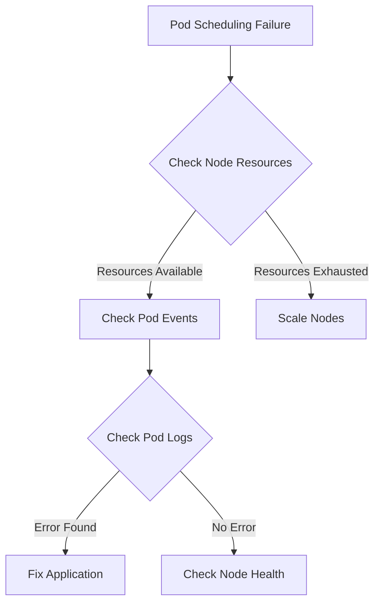
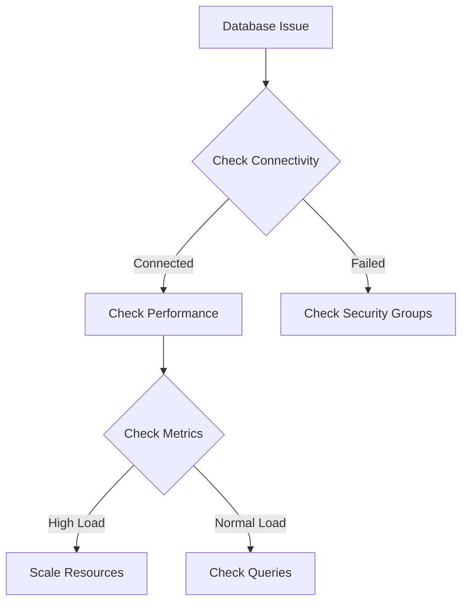
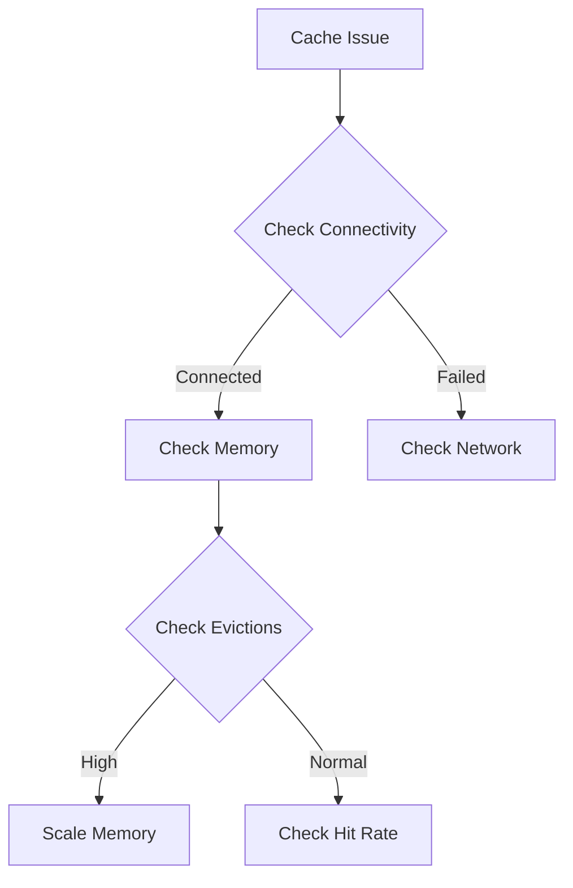
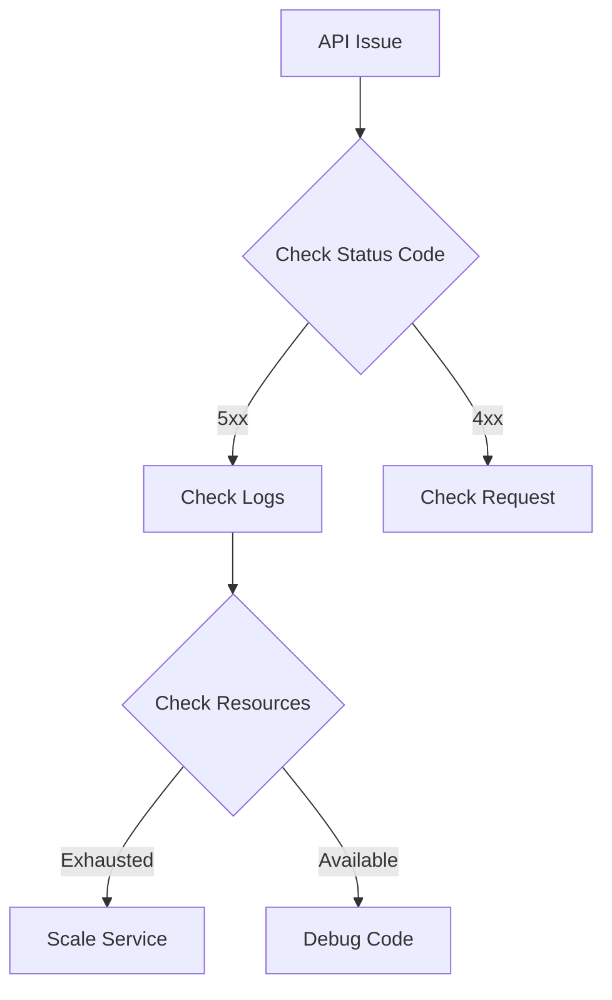
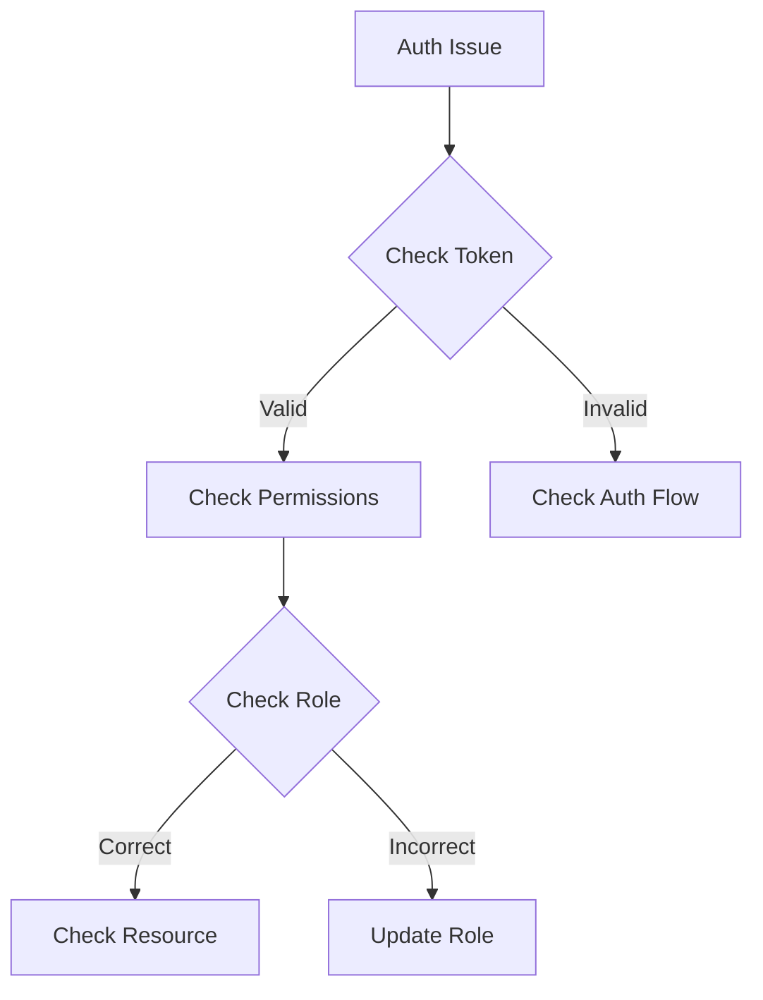

<!-- Human Tasks:
1. Verify access to CloudWatch and Prometheus monitoring dashboards
2. Ensure PagerDuty integration is configured for alerts
3. Test VPN access to production environment
4. Validate access to logging systems (CloudWatch, ELK)
5. Confirm access to AWS Console and required IAM permissions -->

# Mint Replica Lite Troubleshooting Guide

## Infrastructure Troubleshooting

<!-- Addresses requirement: Infrastructure Monitoring (2.5.1 Production Environment) -->
### Kubernetes Cluster Issues



#### Pod Scheduling Failures
1. Check node resources:
```bash
kubectl describe nodes | grep -A 5 "Allocated resources"
kubectl top nodes
```

2. Verify pod events:
```bash
kubectl describe pod <pod-name>
kubectl get events --sort-by='.lastTimestamp'
```

3. Check scheduler logs:
```bash
kubectl logs -n kube-system $(kubectl get pods -n kube-system | grep kube-scheduler | awk '{print $1}')
```

#### Node Health Issues
1. Check node status:
```bash
kubectl get nodes -o wide
kubectl describe node <node-name>
```

2. Verify kubelet status:
```bash
systemctl status kubelet
journalctl -u kubelet
```

3. Check node metrics:
```bash
kubectl top node <node-name>
```

#### Resource Constraints
1. Monitor resource usage:
```bash
kubectl top pods --all-namespaces
kubectl describe resourcequotas
```

2. Check HPA status:
```bash
kubectl get hpa
kubectl describe hpa <hpa-name>
```

<!-- Addresses requirement: High Availability (2.5.4 Availability Architecture) -->
### Database Issues



#### Connection Problems
1. Verify connectivity:
```bash
psql -h <host> -U <user> -d <database>
telnet <host> 5432
```

2. Check security groups:
```bash
aws ec2 describe-security-groups --group-ids <sg-id>
```

3. Validate credentials:
```bash
aws secretsmanager get-secret-value --secret-id <secret-name>
```

#### Replication Lag
1. Check replication status:
```sql
SELECT * FROM pg_stat_replication;
SELECT now() - pg_last_xact_replay_timestamp() AS replication_lag;
```

2. Monitor write-ahead logs:
```sql
SELECT * FROM pg_stat_wal_receiver;
```

#### Performance Degradation
1. Identify slow queries:
```sql
SELECT * FROM pg_stat_activity WHERE state = 'active';
```

2. Check index usage:
```sql
SELECT * FROM pg_stat_user_indexes;
```

### Cache Issues



#### Redis Cluster Problems
1. Check cluster health:
```bash
redis-cli cluster info
redis-cli cluster nodes
```

2. Monitor memory usage:
```bash
redis-cli info memory
```

#### Memory Pressure
1. Check eviction metrics:
```bash
redis-cli info stats | grep evicted
```

2. Monitor memory fragmentation:
```bash
redis-cli info memory | grep fragmentation
```

## Application Troubleshooting

<!-- Addresses requirement: Security Infrastructure (6.3.2 Security Monitoring and Response) -->
### API Service Issues



#### Authentication Failures
1. Check JWT token:
```bash
curl -v -H "Authorization: Bearer <token>" https://api.mintreplica.com/health
```

2. Verify OAuth flow:
```bash
curl -X POST https://api.mintreplica.com/oauth/token
```

#### Rate Limiting Problems
1. Check rate limit headers:
```bash
curl -v https://api.mintreplica.com/api/v1/status
```

2. Monitor rate limit metrics:
```bash
kubectl logs -l app=api-gateway | grep "rate limit"
```

### Mobile App Issues

#### Push Notification Failures
1. Check APNS status:
```bash
aws sns check-if-phone-number-is-opted-out --phone-number <number>
```

2. Verify FCM configuration:
```bash
firebase apps:list
```

#### Sync Problems
1. Check sync status:
```bash
curl https://api.mintreplica.com/api/v1/sync/status
```

2. Monitor sync metrics:
```bash
kubectl logs -l app=sync-service
```

### Web App Issues

#### Loading Performance
1. Check CDN status:
```bash
aws cloudfront get-distribution --id <distribution-id>
```

2. Monitor asset loading:
```bash
curl -w "%{time_total}\n" -o /dev/null https://app.mintreplica.com
```

## Security Troubleshooting

<!-- Addresses requirement: Security Infrastructure (6.3.2 Security Monitoring and Response) -->
### Authentication Issues



#### JWT Token Problems
1. Validate token:
```bash
jwt verify <token> <secret>
```

2. Check token claims:
```bash
jwt decode <token>
```

#### OAuth Flow Failures
1. Check OAuth logs:
```bash
kubectl logs -l app=auth-service | grep oauth
```

2. Verify client configuration:
```bash
aws secretsmanager get-secret-value --secret-id oauth-clients
```

### Encryption Issues

#### Key Management Problems
1. Check KMS status:
```bash
aws kms describe-key --key-id <key-id>
```

2. Verify key rotation:
```bash
aws kms get-key-rotation-status --key-id <key-id>
```

## Performance Troubleshooting

### Backend Performance

#### API Latency
1. Check service latency:
```bash
kubectl top pods -l app=api-service
```

2. Monitor database queries:
```sql
SELECT * FROM pg_stat_activity WHERE state != 'idle';
```

#### Cache Hit Rates
1. Monitor Redis metrics:
```bash
redis-cli info stats | grep hit_rate
```

2. Check cache size:
```bash
redis-cli info memory | grep used_memory_human
```

### Frontend Performance

#### Load Times
1. Check CDN metrics:
```bash
aws cloudfront get-distribution-config --id <distribution-id>
```

2. Monitor asset loading:
```bash
curl -w "%{time_starttransfer}\n" -o /dev/null https://app.mintreplica.com
```

## Initial Diagnosis Checklist

- [ ] Check monitoring alerts in Prometheus/Grafana
- [ ] Review CloudWatch logs for errors
- [ ] Verify system metrics in dashboards
- [ ] Check service health endpoints
- [ ] Validate network connectivity
- [ ] Review recent deployments
- [ ] Check infrastructure status

## Resolution Steps Checklist

- [ ] Document issue timeline
- [ ] Identify affected components
- [ ] Review relevant logs and metrics
- [ ] Apply necessary fixes
- [ ] Verify solution effectiveness
- [ ] Update documentation
- [ ] Create post-mortem if needed
- [ ] Implement preventive measures

## Maintenance Notes

Last Updated: Version controlled through Git
Review Frequency: Monthly
Approvers:
- Infrastructure Team Lead
- Security Team Lead
- Operations Team Lead