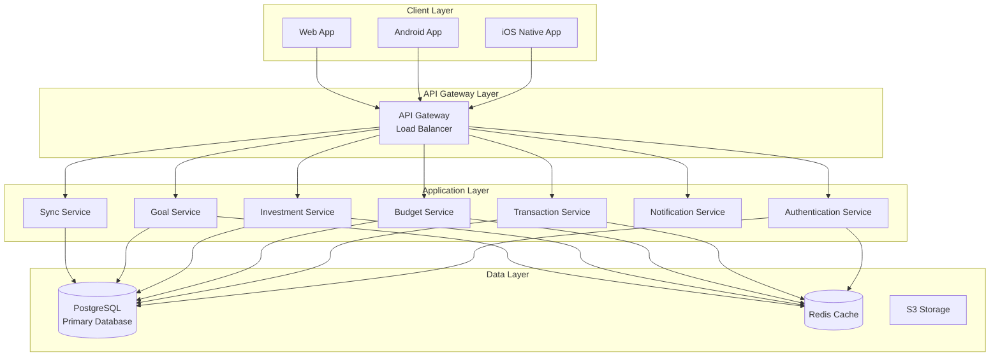
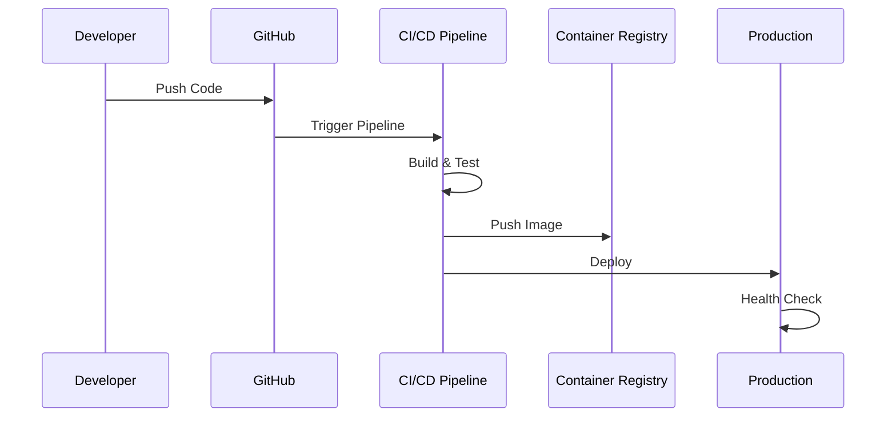
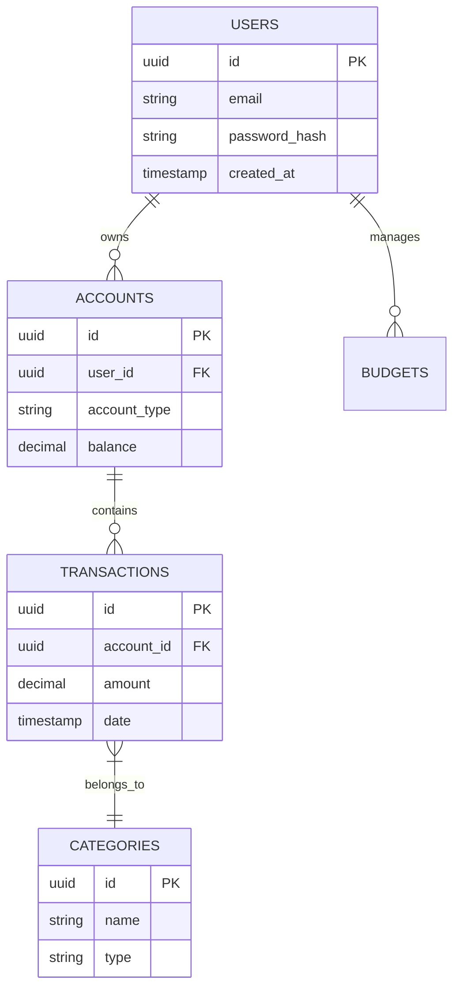

# Mint Replica Lite Backend Service

<!-- Human Tasks:
1. Set up PostgreSQL database with credentials from .env
2. Configure Redis instance with appropriate memory allocation
3. Generate and configure SSL certificates for production
4. Set up monitoring and alerting thresholds
5. Configure backup retention policies
6. Set up CI/CD pipeline access and permissions
-->

## Project Overview

Mint Replica Lite is a comprehensive financial management system that provides users with a consolidated view of their financial accounts, transactions, budgets, and investment portfolios. This backend service powers the core functionality of the platform through a secure, scalable, and maintainable architecture.

### Version: v1
### API Version: ${API_VERSION}
### Last Updated: ${DATETIME_FORMAT}
### Maintained by: Backend Team
### Review Frequency: Monthly

## Architecture



## Prerequisites

### Required Software
- Python ^3.9.0
- PostgreSQL ^13.0
- Redis ^6.0
- Docker ^20.0

### Development Tools
- Git
- Visual Studio Code (recommended)
- Docker Desktop
- Python virtual environment

## Getting Started

### Environment Setup

```bash
# Clone the repository
git clone https://github.com/your-org/mint-replica-lite.git
cd mint-replica-lite/backend

# Create and activate virtual environment
python -m venv venv
source venv/bin/activate  # Unix
.\venv\Scripts\activate   # Windows

# Install dependencies
pip install -r requirements.txt

# Create and configure .env file
cp .env.example .env
# Edit .env with your configuration

# Initialize database
python manage.py db init
python manage.py db migrate
python manage.py db upgrade
```

### Database Setup

```sql
-- Create database
CREATE DATABASE mintreplicadb;

-- Create user and grant privileges
CREATE USER mintreplica WITH PASSWORD 'your_password';
GRANT ALL PRIVILEGES ON DATABASE mintreplicadb TO mintreplica;
```

### Running the Service

```bash
# Development mode
python run.py

# Production mode with Gunicorn
gunicorn --config gunicorn_config.py wsgi:app
```

## Development

### Project Structure
```
src/backend/
├── app/
│   ├── api/            # API endpoints
│   ├── core/           # Core business logic
│   ├── models/         # Database models
│   ├── services/       # Business services
│   ├── utils/          # Utility functions
│   └── config.py       # Configuration
├── tests/              # Test suite
├── migrations/         # Database migrations
└── requirements/       # Dependencies
```

### API Documentation

Base URL: `/api/v1`

Example API request:

```python
import requests

response = requests.post(
    'http://localhost:8000/api/v1/auth/login',
    json={
        'email': 'user@example.com',
        'password': 'secure_password'
    }
)
```

## Testing

### Running Tests

```bash
# Run all tests
pytest

# Run with coverage
pytest --cov=app tests/

# Generate coverage report
coverage html
```

## Deployment

### Docker Deployment

```dockerfile
# Build image
docker build -t mint-replica-backend:latest .

# Run container
docker run -d \
    --name mint-replica-backend \
    -p 8000:8000 \
    -e DATABASE_URL=${DATABASE_URL} \
    -e REDIS_URL=${REDIS_URL} \
    mint-replica-backend:latest
```

### Production Deployment Flow



## Security

### Authentication
- JWT-based authentication
- Token expiration: 30 minutes
- Refresh token rotation
- Rate limiting: 100 requests/minute

### Data Protection
- TLS 1.3 for all communications
- AES-256 encryption for sensitive data
- Field-level encryption for PII
- Secure credential storage

## Monitoring

### Health Checks
- `/health` - Service health status
- `/metrics` - Prometheus metrics endpoint

### Logging
```python
# Log format
{
    "timestamp": "ISO8601",
    "level": "INFO|WARNING|ERROR",
    "service": "service_name",
    "trace_id": "uuid",
    "message": "log_message"
}
```

### Metrics
- Request latency
- Error rates
- Database connection pool
- Cache hit/miss ratio
- API endpoint usage

## Database Schema



## Contributing

1. Fork the repository
2. Create a feature branch
3. Commit changes
4. Push to the branch
5. Create a Pull Request

## License

Copyright (c) 2023 Mint Replica Lite Team. All rights reserved.